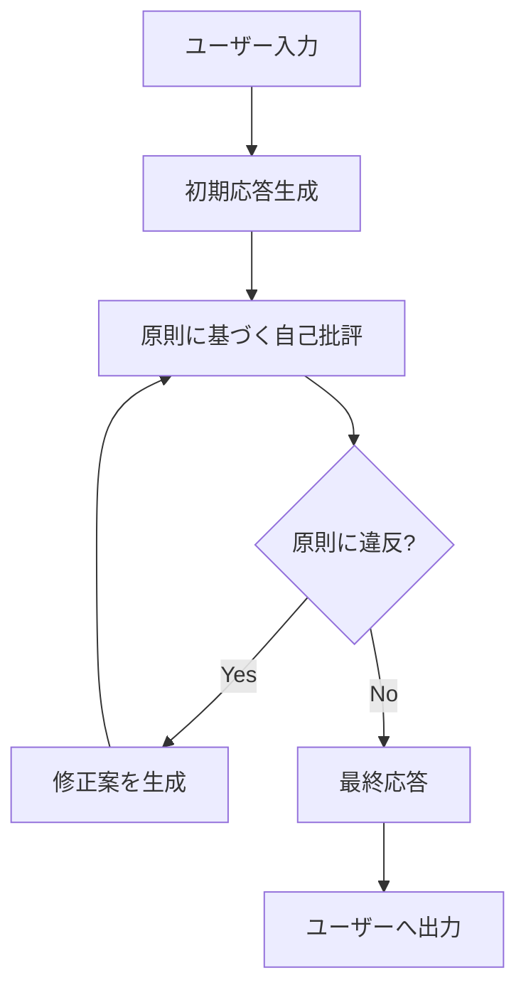
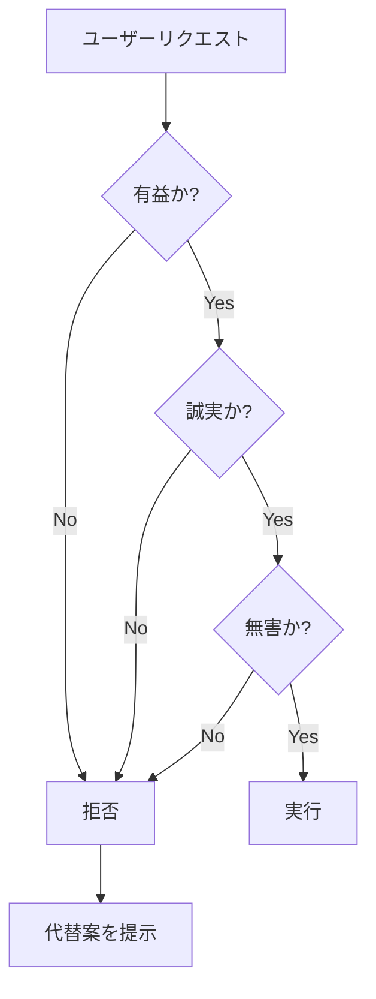
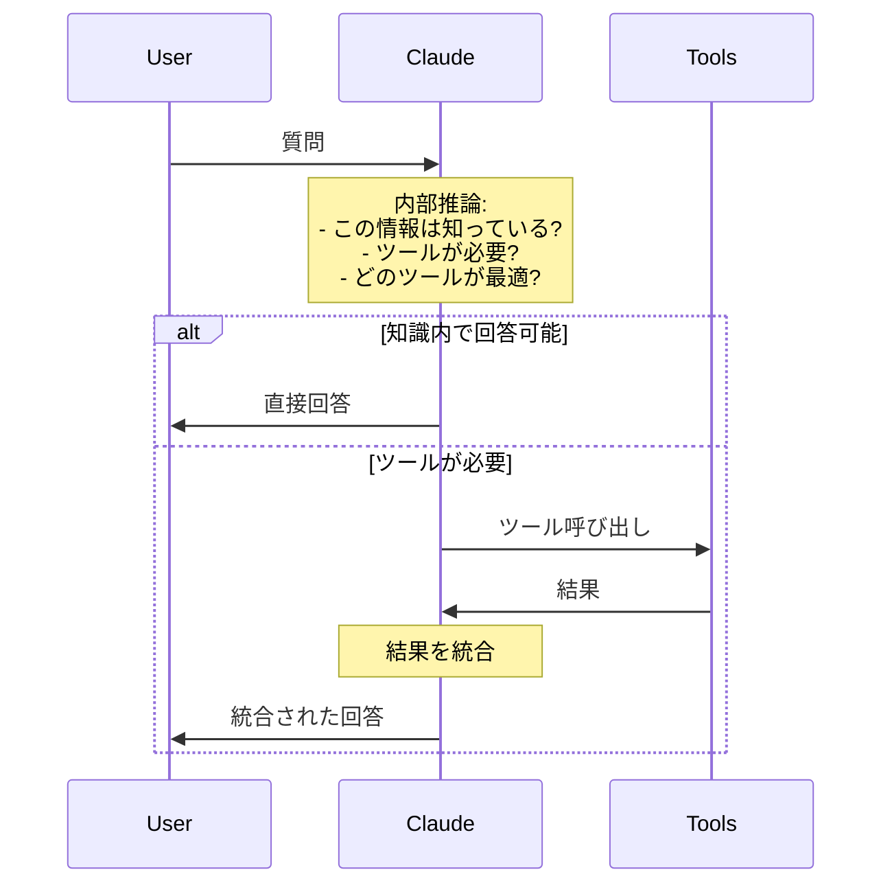

# Claude AIの設計思想

## 概要

このドキュメントでは、Anthropic社が公開している情報に基づき、Claude AIの核となる設計思想を体系的に整理します。

Claudeの特徴は単にモデルサイズや性能だけでなく、**明確な設計原則**に基づいて構築されている点にあります。

---

## 🎯 Constitutional AI（憲法型AI）

### 基本概念

Constitutional AIは、Anthropicが開発した、**明文化された原則（憲法）に基づいてAIを訓練する手法**です。

従来のRLHF（人間のフィードバックからの強化学習）だけに依存するのではなく、以下を実現します：

1. **価値判断の外在化**: AIの判断基準を外部の明文化された原則として定義
2. **自己修正プロセス**: モデルが自ら原則を参照し、出力を修正
3. **透明性**: なぜそう判断したかを原則に基づいて説明可能

### 憲法の構成要素

Claudeの憲法は以下のような原則を含みます（公開情報より）：

```yaml
原則例:
  - 人権の尊重: すべての人間を平等に扱い、差別しない
  - 非暴力: 暴力的な行為を助長しない
  - 誠実性: 不確実な情報は明示する
  - 有益性: ユーザーの目的達成を支援する
  - プライバシー: 個人情報の保護を優先する
```

### Constitutional AIのプロセス



**ステップ**:

1. **初期応答**: ユーザーの質問に対する初期的な回答を生成
2. **自己批評**: 憲法の各原則に照らして自己評価
3. **修正**: 違反がある場合、原則に沿うように修正
4. **反復**: 原則を満たすまで繰り返し
5. **出力**: 最終的な応答を提供

### 実装への示唆

Claude風システムを構築する際の応用：

```typescript
// 憲法をシステムプロンプトに組み込む例
const constitution = `
あなたは以下の原則に従って行動します：

1. **誠実性**: 不確実な情報は明示的に「推測」として述べる
2. **有益性**: ユーザーの目標達成を最優先する
3. **安全性**: 有害な出力を避ける
4. **透明性**: 判断理由を説明できるようにする

これらの原則に違反する場合、出力前に自己修正してください。
`

const systemPrompt = `${baseInstructions}\n\n${constitution}`
```

**外部ファイル化の例**:

```typescript
// constitution.yaml
import fs from 'fs'
import yaml from 'yaml'

const constitution = yaml.parse(
  fs.readFileSync('./config/constitution.yaml', 'utf8')
)

// 各応答前にチェック
function validateResponse(response: string, constitution: any): boolean {
  for (const principle of constitution.principles) {
    if (!checkPrinciple(response, principle)) {
      return false
    }
  }
  return true
}
```

---

## 🎯 3H原則: Helpful, Honest, Harmless

Claudeの行動指針となる3つの柱です。

### 1. Helpful（有益性）

**定義**: ユーザーの目的達成を最大限支援する

**具体的な振る舞い**:
- ユーザーの意図を理解し、最適な解決策を提供
- 必要に応じて追加の提案や代替案を提示
- 不明点があれば質問して明確化

**実装例**:

```typescript
// タスクの意図を確認するステップを追加
async function executeTask(userRequest: string) {
  // 1. 意図の理解
  const intent = await clarifyIntent(userRequest)

  // 2. 最適なアプローチの提案
  const approaches = await proposeApproaches(intent)

  // 3. ユーザーの選択を待つ（必要に応じて）
  if (approaches.length > 1) {
    const selected = await askUser(approaches)
    return executeApproach(selected)
  }

  return executeApproach(approaches[0])
}
```

### 2. Honest（誠実性）

**定義**: 真実を述べ、不確実性を明示する

**具体的な振る舞い**:
- 知らないことは「知らない」と明言
- 推測する場合は「推測」と明示
- 情報源がある場合は引用
- 誤りを指摘された場合は認める

**実装例**:

```typescript
// 不確実性の明示
interface Response {
  content: string
  confidence: 'high' | 'medium' | 'low'
  sources?: string[]
}

function generateResponse(query: string): Response {
  const result = llm.generate(query)

  // 知識カットオフ後の情報
  if (isAfterKnowledgeCutoff(query)) {
    return {
      content: "この情報は私の知識カットオフ（2024年4月）以降のものです。最新情報は公式ソースをご確認ください。",
      confidence: 'low'
    }
  }

  // 推測の場合
  if (requiresSpeculation(query)) {
    return {
      content: `以下は推測です：${result}`,
      confidence: 'medium'
    }
  }

  return {
    content: result,
    confidence: 'high',
    sources: extractSources(result)
  }
}
```

### 3. Harmless（無害性）

**定義**: 有害な出力を避ける

**具体的な振る舞い**:
- 違法行為の支援を拒否
- 差別的な内容を生成しない
- プライバシーを侵害しない
- 安全上のリスクを考慮

**実装例**:

```typescript
// セーフティフィルター
const safetyChecks = [
  checkForIllegalContent,
  checkForDiscrimination,
  checkForPrivacyViolation,
  checkForSafetyRisks
]

async function safeguardedResponse(
  response: string
): Promise<string | null> {
  for (const check of safetyChecks) {
    const violation = await check(response)
    if (violation) {
      return null // または修正案を生成
    }
  }
  return response
}
```

### 3H原則のバランス

重要なのは、3つの原則の**バランス**です：



**例**: 違法行為の質問に対して

```typescript
// ❌ 悪い例（Helpfulだけ）
"はい、その方法は..."

// ✅ 良い例（3Hバランス）
"そのご質問は違法行為に関するものです（Harmless）。
お手伝いできません（Honest）。
代わりに、合法的な目的を達成する方法をご提案できます（Helpful）。"
```

---

## 🧠 内部推論と出力の分離

Claudeの重要な特徴の一つは、**思考プロセスと出力を分離**していることです。

### 基本概念

```
[内部推論] → [フィルタリング・要約] → [ユーザー出力]
```

**内部では**:
- 複雑な推論を実行
- 複数の選択肢を検討
- 根拠を収集
- 不確実性を評価

**出力では**:
- 要約された結論
- 必要な情報のみ
- 構造化された形式

### 実装アプローチ

#### 1. Extended Thinking（拡張思考）

```typescript
interface ThinkingProcess {
  reasoning: string[]      // 内部推論ステップ
  alternatives: string[]   // 検討した代替案
  evidence: string[]       // 根拠
  confidence: number       // 確信度
}

interface Output {
  answer: string           // ユーザーへの回答
  summary: string          // 要約
  reasoning?: string       // 必要に応じて推論を開示
}

async function generateWithThinking(
  query: string
): Promise<Output> {
  // 1. 内部で推論
  const thinking: ThinkingProcess = await deepReasoning(query)

  // 2. 出力を構成
  const output: Output = {
    answer: synthesizeAnswer(thinking),
    summary: summarizeConclusion(thinking)
  }

  // 3. 必要に応じて推論を開示
  if (userAskedForReasoning(query)) {
    output.reasoning = formatReasoning(thinking)
  }

  return output
}
```

#### 2. Chain of Thoughtの実装

```typescript
// LangChainを使った実装例
import { ChatAnthropic } from "@langchain/anthropic"
import { PromptTemplate } from "@langchain/core/prompts"

const thinkingPrompt = new PromptTemplate({
  template: `
<thinking>
ステップバイステップで考えます：
1. 問題の理解: {question}
2. 必要な情報の特定
3. 推論プロセス
4. 結論の導出
</thinking>

<output>
{question}に対する回答：
</output>
`,
  inputVariables: ["question"]
})

const model = new ChatAnthropic({
  modelName: "claude-opus-4-5-20251101",
  temperature: 0
})

async function reasonAndRespond(question: string) {
  const response = await model.invoke(
    await thinkingPrompt.format({ question })
  )

  // <output>タグ内のみをユーザーに返す
  return extractOutput(response.content)
}
```

### ツール利用における推論

Claudeはツールを使う前に**内部で必要性を判断**します：



**実装例**:

```typescript
async function intelligentToolUse(query: string) {
  // 1. 内部判断: ツールが必要か？
  const needsTool = await assessToolNeed(query)

  if (!needsTool) {
    return directAnswer(query)
  }

  // 2. 最適なツールの選択
  const toolChoice = await selectBestTool(query, availableTools)

  // 3. ツール実行
  const toolResult = await executeTool(toolChoice)

  // 4. 結果の統合
  return synthesizeResponse(query, toolResult)
}

async function assessToolNeed(query: string): Promise<boolean> {
  // LLMに判断させる
  const decision = await llm.generate(`
以下の質問に答えるために、外部ツール（検索、ファイル読み込みなど）が必要ですか？

質問: ${query}

内部知識で回答可能な場合は "no"、ツールが必要な場合は "yes" と答えてください。
`)

  return decision.includes("yes")
}
```

---

## 🛡️ 安全性設計

Claudeの安全性は多層的なアプローチで実現されています。

### 1. 入力段階のフィルタリング

```typescript
interface InputFilter {
  check(input: string): Promise<FilterResult>
}

interface FilterResult {
  safe: boolean
  reason?: string
  suggestion?: string
}

class SafetyLayer {
  private filters: InputFilter[] = [
    new PromptInjectionFilter(),
    new MaliciousContentFilter(),
    new PrivacyViolationFilter()
  ]

  async validate(input: string): Promise<FilterResult> {
    for (const filter of this.filters) {
      const result = await filter.check(input)
      if (!result.safe) {
        return result
      }
    }
    return { safe: true }
  }
}
```

### 2. 出力段階の検証

```typescript
class OutputValidator {
  async validate(output: string): Promise<boolean> {
    // Constitutional AI的なチェック
    const checks = [
      this.checkHarmfulness(output),
      this.checkAccuracy(output),
      this.checkBias(output)
    ]

    const results = await Promise.all(checks)
    return results.every(r => r.passed)
  }

  private async checkHarmfulness(output: string) {
    // LLMによる自己評価
    const evaluation = await this.llm.generate(`
以下の出力は有害ですか？（違法、差別的、危険など）

出力: ${output}

"yes" または "no" で答えてください。理由も述べてください。
`)

    return {
      passed: !evaluation.includes("yes"),
      reason: evaluation
    }
  }
}
```

### 3. 段階的開示（Progressive Disclosure）

敏感な情報を扱う際の戦略：

```typescript
class ProgressiveDisclosure {
  async handleSensitiveQuery(query: string) {
    // 1. 意図を確認
    const intent = await this.clarifyIntent(query)

    // 2. 正当な用途か判断
    if (!this.isLegitimateUse(intent)) {
      return this.refuseWithExplanation(intent)
    }

    // 3. 段階的に情報を提供
    return this.provideGradually(query, intent)
  }

  private async provideGradually(
    query: string,
    intent: Intent
  ): Promise<string[]> {
    return [
      this.provideGeneral(query),      // 一般的な情報
      this.provideSpecific(query),      // 具体的な情報（確認後）
      this.provideDetailed(query)       // 詳細（さらに確認後）
    ]
  }
}
```

---

## 🔧 ツール利用の思想

Claudeのツール利用は「最後の手段」アプローチです。

### 基本方針

```
知識内で回答可能 → 直接回答
     ↓ No
ツールで確認可能 → ツール使用
     ↓ No
明示的に不明と伝える
```

### ツール判断ゲート

```typescript
interface ToolGate {
  shouldUseTool(query: string, context: Context): Promise<ToolDecision>
}

interface ToolDecision {
  useTool: boolean
  tool?: string
  reason: string
}

class IntelligentToolGate implements ToolGate {
  async shouldUseTool(
    query: string,
    context: Context
  ): Promise<ToolDecision> {
    // 1. 知識内で回答可能か？
    if (await this.canAnswerDirectly(query, context)) {
      return {
        useTool: false,
        reason: "内部知識で回答可能"
      }
    }

    // 2. ツールで補完できるか？
    const relevantTool = await this.findRelevantTool(query)
    if (relevantTool) {
      return {
        useTool: true,
        tool: relevantTool.name,
        reason: `${relevantTool.name}で最新情報を取得`
      }
    }

    // 3. どちらも不可
    return {
      useTool: false,
      reason: "回答に必要な情報がありません"
    }
  }
}
```

### ツール結果の統合

```typescript
async function integrateToolResults(
  query: string,
  toolResults: ToolResult[]
): Promise<string> {
  // 1. 結果の信頼性評価
  const validated = await validateResults(toolResults)

  // 2. 矛盾の検出
  const conflicts = detectConflicts(validated)
  if (conflicts.length > 0) {
    return handleConflicts(conflicts)
  }

  // 3. 知識と結果の統合
  const integrated = await synthesize(query, validated)

  // 4. 出典の明示
  return appendSources(integrated, validated)
}
```

---

## 💾 記憶とセッション管理

Claudeは会話履歴を効率的に管理します。

### メモリの階層

```
1. Short-term (会話内)
   └─ 現在のセッションのみ

2. Long-term (要約)
   └─ 過去の会話の要約

3. Semantic (ベクトル)
   └─ 重要な情報の埋め込み
```

### 実装パターン

```typescript
interface Memory {
  shortTerm: Message[]       // 直近のメッセージ
  longTerm: Summary[]        // 要約された過去
  semantic: EmbeddedFacts[]  // ベクトル化された事実
}

class MemoryManager {
  async buildContext(currentQuery: string): Promise<Context> {
    // 1. Short-term: そのまま使用
    const recent = this.memory.shortTerm

    // 2. Long-term: 関連する要約を取得
    const relevantSummaries = await this.findRelevant(
      currentQuery,
      this.memory.longTerm
    )

    // 3. Semantic: ベクトル検索
    const relatedFacts = await this.vectorSearch(
      currentQuery,
      this.memory.semantic
    )

    // 4. 統合
    return this.composeContext(recent, relevantSummaries, relatedFacts)
  }
}
```

---

## 🎯 実装への応用

### システムプロンプトの構成

Claude風システムを構築する際の推奨構成：

```typescript
const systemPrompt = `
# あなたの役割
${roleDefinition}

# 憲法（Constitutional Principles）
${constitution}

# 行動指針
## Helpful
- ユーザーの目的達成を最優先
- 不明点は質問する

## Honest
- 不確実な情報は明示
- 知らないことは認める

## Harmless
- 有害な出力を避ける
- 安全性を優先

# ツール利用
- まず内部知識で回答を試みる
- 必要な場合のみツールを使用
- ツール結果は必ず検証

# 出力形式
${outputFormat}
`
```

### エージェントループへの統合

```typescript
async function claudeStyleAgent(task: string) {
  // 1. 憲法チェック
  if (!await constitutionalCheck(task)) {
    return refuse(task)
  }

  // 2. 内部推論
  const thinking = await internalReasoning(task)

  // 3. ツール必要性判断
  if (thinking.needsTools) {
    const toolResults = await executeTools(thinking.tools)
    thinking.incorporate(toolResults)
  }

  // 4. 3H原則に基づく出力生成
  const output = await generate3HCompliant(thinking)

  // 5. 安全性検証
  if (!await safetyCheck(output)) {
    return revise(output)
  }

  return output
}
```

---

## 📚 参考資料

### Anthropic公式

- [Constitutional AI: Harmlessness from AI Feedback](https://arxiv.org/abs/2212.08073) - Constitutional AIの原論文
- [Claude's Character](https://www.anthropic.com/claude-character) - Claudeの性格設定
- [Model Card: Claude](https://www.anthropic.com/model-card) - モデルの詳細仕様

### 関連ドキュメント

このリポジトリ内：
- [02-context-engineering.md](./02-context-engineering.md) - コンテキスト設計の詳細
- [03-agent-architecture.md](./03-agent-architecture.md) - エージェント実装
- [04-implementation-guide.md](./04-implementation-guide.md) - 実装手順

---

**次**: [02-context-engineering.md](./02-context-engineering.md) - Claudeの核心技術であるContext Engineeringを学ぶ
