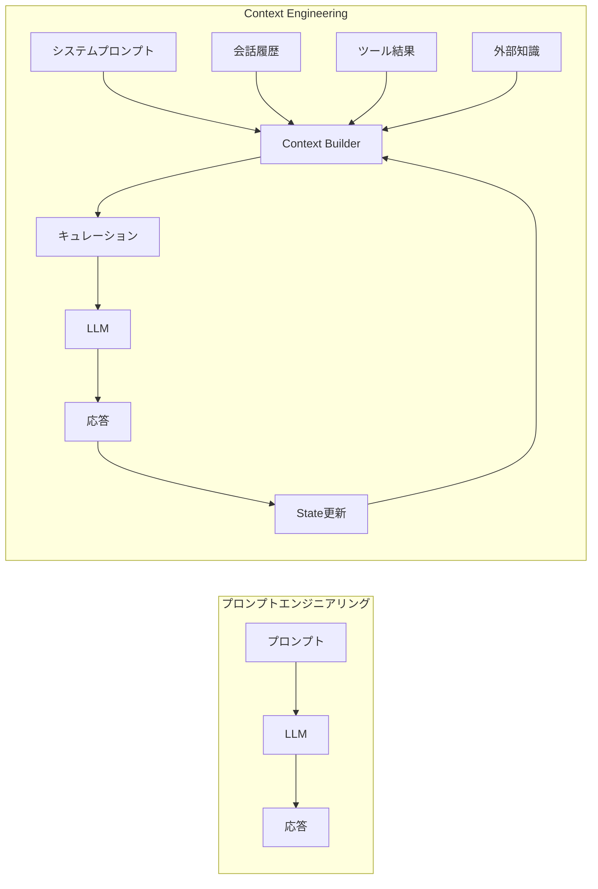
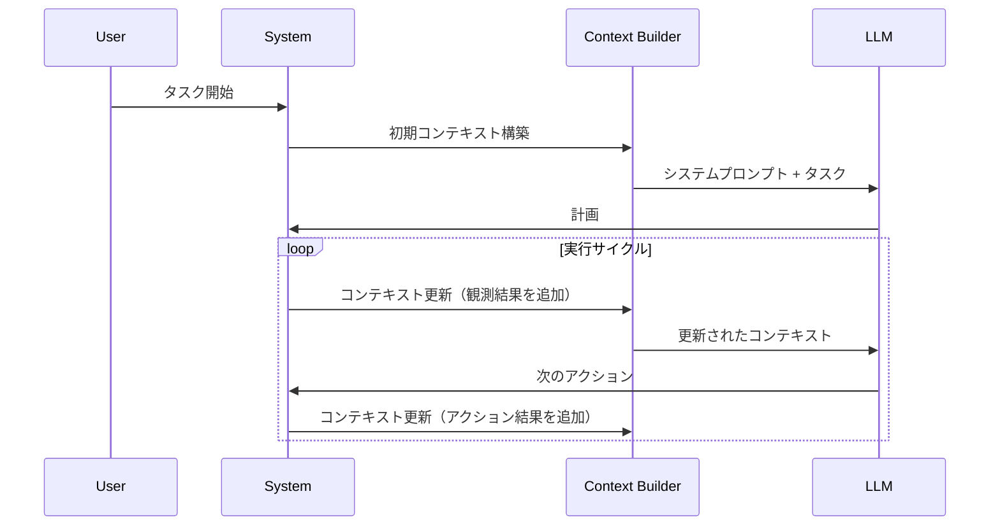

# Context Engineering - Claudeの核心技術

## 概要

**Context Engineering**（コンテキストエンジニアリング）は、Anthropicが最も強調する技術概念であり、Claudeの性能を支える最重要要素です。

公式ブログ記事 [Effective context engineering for AI agents](https://www.anthropic.com/engineering/effective-context-engineering-for-ai-agents) によれば：

> "Claudeの性能の多くはモデルサイズではなく、**コンテキストの設計**によるもの"

---

## 🎯 Context Engineeringとは

### 定義

> **Context Engineering**とは、プロンプト単体ではなく、**LLMに与えるコンテキスト全体を設計対象として扱う**アプローチです。

### プロンプトエンジニアリングとの違い

| 観点 | プロンプトエンジニアリング | Context Engineering |
|------|-------------------------|-------------------|
| **対象** | プロンプト文字列のみ | コンテキスト全体（履歴、ツール、状態） |
| **タイミング** | 1回のリクエスト | 会話全体のライフサイクル |
| **最適化** | 文言の調整 | 情報のキュレーション |
| **目標** | 良い応答を得る | 効率的で一貫した対話 |



---

## 📐 Context Engineeringの5つの設計次元

Anthropicは、コンテキストを以下の5つの次元で設計することを推奨しています。

### 1. 何を（What）与えるか

**情報選択**の次元です。

```typescript
interface ContextSelection {
  // 含めるもの
  include: {
    systemPrompt: string      // 役割・指示
    conversationHistory: Message[]  // 会話履歴
    toolResults: ToolResult[]       // ツール実行結果
    externalKnowledge: string[]     // 外部知識
    currentState: State             // 現在の状態
  }

  // 除外するもの
  exclude: {
    irrelevantHistory: Message[]    // 無関係な履歴
    staleToolResults: ToolResult[]  // 古いツール結果
    redundantInfo: string[]         // 冗長な情報
  }
}
```

**ベストプラクティス**:

```typescript
function selectContextContent(
  task: string,
  fullHistory: Message[]
): ContextSelection {
  return {
    include: {
      systemPrompt: buildSystemPrompt(task),

      // 関連する履歴のみ（ベクトル検索）
      conversationHistory: filterRelevant(fullHistory, task),

      // 最新のツール結果
      toolResults: getRecentToolResults(60), // 60秒以内

      // タスク固有の知識
      externalKnowledge: retrieveKnowledge(task),

      // 現在のゴールと制約
      currentState: {
        goal: extractGoal(task),
        constraints: extractConstraints(task),
        progress: calculateProgress()
      }
    },

    exclude: {
      // 3ターン以上前の無関係な会話
      irrelevantHistory: filterIrrelevant(fullHistory, task, 3),

      // 1分以上前のツール結果
      staleToolResults: getStaleToolResults(60),

      // 重複する情報
      redundantInfo: deduplicateInfo(fullHistory)
    }
  }
}
```

### 2. いつ（When）与えるか

**タイミング**の次元です。



**実装例**:

```typescript
class ContextTiming {
  // タスク開始時
  async onTaskStart(task: string): Promise<Context> {
    return {
      systemPrompt: this.buildSystemPrompt(),
      goal: task,
      history: [],
      tools: this.getAvailableTools()
    }
  }

  // ツール実行後
  async onToolExecution(
    context: Context,
    tool: string,
    result: any
  ): Promise<Context> {
    // 新しい観測を追加
    return {
      ...context,
      observations: [
        ...context.observations,
        {
          tool,
          result,
          timestamp: Date.now()
        }
      ]
    }
  }

  // LLM応答後
  async onLLMResponse(
    context: Context,
    response: string
  ): Promise<Context> {
    // 履歴に追加
    return {
      ...context,
      history: [
        ...context.history,
        { role: "assistant", content: response }
      ]
    }
  }

  // 定期的なクリーンアップ
  async onContextWindowThreshold(
    context: Context
  ): Promise<Context> {
    // 古い情報を要約
    const summary = await this.summarize(context.history)

    return {
      ...context,
      history: [summary, ...context.history.slice(-5)],
      observations: context.observations.filter(
        o => Date.now() - o.timestamp < 300000 // 5分以内
      )
    }
  }
}
```

### 3. どの形式で（How）与えるか

**構造化**の次元です。

LLMは構造化された情報をより効率的に処理できます。

**悪い例**（非構造化）:

```typescript
const context = `
The user wants to analyze sales data.
We have data from 2023 and 2024.
The data includes revenue, costs, and profit.
Last time we found that Q2 had the highest revenue.
`
```

**良い例**（構造化）:

```typescript
const context = {
  task: {
    type: "analysis",
    subject: "sales_data"
  },

  data_available: {
    years: [2023, 2024],
    metrics: ["revenue", "costs", "profit"],
    granularity: "quarterly"
  },

  previous_findings: [
    {
      insight: "Q2 had highest revenue",
      year: 2023,
      confidence: "high"
    }
  ],

  current_goal: "Compare 2023 vs 2024 performance"
}

// XML形式での提供
const xmlContext = `
<context>
  <task type="analysis" subject="sales_data" />
  <data_available>
    <years>2023, 2024</years>
    <metrics>revenue, costs, profit</metrics>
  </data_available>
  <previous_findings>
    <finding confidence="high">
      Q2 2023 had highest revenue
    </finding>
  </previous_findings>
  <current_goal>
    Compare 2023 vs 2024 performance
  </current_goal>
</context>
`
```

**実装パターン**:

```typescript
class ContextFormatter {
  // 状態をXML形式に
  formatState(state: State): string {
    return `
<state>
  <goal>${state.goal}</goal>
  <progress>${state.progress}%</progress>

  <known_facts>
    ${state.facts.map(f => `<fact source="${f.source}">${f.content}</fact>`).join('\n    ')}
  </known_facts>

  <open_questions>
    ${state.questions.map(q => `<question priority="${q.priority}">${q.text}</question>`).join('\n    ')}
  </open_questions>

  <plan>
    ${state.plan.map((step, i) => `<step id="${i}" status="${step.status}">${step.description}</step>`).join('\n    ')}
  </plan>
</state>
`
  }

  // 観測結果を構造化
  formatObservations(observations: Observation[]): string {
    return `
<observations>
  ${observations.map(obs => `
  <observation>
    <source>${obs.source}</source>
    <timestamp>${obs.timestamp}</timestamp>
    <content>${obs.content}</content>
    <relevance>${obs.relevance}</relevance>
  </observation>
  `).join('\n')}
</observations>
`
  }
}
```

### 4. 何を捨てるか（What to Remove）

**圧縮**の次元です。

コンテキストウィンドウは有限なので、何を捨てるかの戦略が重要です。

```typescript
interface CompressionStrategy {
  // 優先度ベースの削除
  priorityBased(items: ContextItem[]): ContextItem[]

  // 時間ベースの削除
  timeBased(items: ContextItem[], maxAge: number): ContextItem[]

  // 関連性ベースの削除
  relevanceBased(items: ContextItem[], query: string): ContextItem[]

  // 重複削除
  deduplicate(items: ContextItem[]): ContextItem[]
}

class ContextCompressor implements CompressionStrategy {
  priorityBased(items: ContextItem[]): ContextItem[] {
    // 優先度スコアを計算
    const scored = items.map(item => ({
      item,
      score: this.calculatePriority(item)
    }))

    // 上位80%を保持
    scored.sort((a, b) => b.score - a.score)
    const threshold = scored.length * 0.8

    return scored.slice(0, threshold).map(s => s.item)
  }

  private calculatePriority(item: ContextItem): number {
    let score = 0

    // 新しいほど高い
    const age = Date.now() - item.timestamp
    score += Math.max(0, 100 - age / 1000)

    // ツール結果は優先
    if (item.type === 'tool_result') {
      score += 50
    }

    // ユーザーメッセージは優先
    if (item.role === 'user') {
      score += 30
    }

    // 長さにペナルティ
    score -= item.content.length / 100

    return score
  }

  relevanceBased(
    items: ContextItem[],
    query: string
  ): ContextItem[] {
    // ベクトル類似度で関連性を計算
    const withRelevance = items.map(item => ({
      item,
      relevance: this.cosineSimilarity(
        this.embed(item.content),
        this.embed(query)
      )
    }))

    // 関連性が0.3以上のものを保持
    return withRelevance
      .filter(wr => wr.relevance >= 0.3)
      .map(wr => wr.item)
  }
}
```

### 5. どう要約するか（How to Summarize）

**再構成**の次元です。

単に削除するのではなく、情報を要約して圧縮します。

```typescript
class ContextSummarizer {
  async summarizeHistory(
    messages: Message[],
    keepRecent: number = 3
  ): Promise<Message[]> {
    // 直近N件は保持
    const recent = messages.slice(-keepRecent)
    const toSummarize = messages.slice(0, -keepRecent)

    if (toSummarize.length === 0) {
      return recent
    }

    // 古い履歴を要約
    const summary = await this.llm.generate(`
以下の会話履歴を要約してください。

重要な情報：
- 達成したタスク
- 発見した事実
- 未解決の問題
- 今後の計画

会話履歴:
${toSummarize.map(m => `${m.role}: ${m.content}`).join('\n')}

簡潔に要約してください（500語以内）。
`)

    // 要約を挿入
    return [
      {
        role: "assistant",
        content: `Previous Conversation Summary:\n${summary}`,
        isSummary: true
      },
      ...recent
    ]
  }

  async summarizeToolResults(
    results: ToolResult[]
  ): Promise<string> {
    // ツール結果を集約
    const grouped = this.groupByTool(results)

    const summaries = await Promise.all(
      Object.entries(grouped).map(async ([tool, results]) => {
        const summary = await this.llm.generate(`
Tool: ${tool}
実行回数: ${results.length}

結果をサマリーしてください：
${results.map(r => r.output).join('\n---\n')}
`)

        return { tool, summary }
      })
    )

    return summaries
      .map(s => `${s.tool}: ${s.summary}`)
      .join('\n\n')
  }
}
```

---

## 🏗️ Context Builderの実装

全ての次元を統合する中核コンポーネントです。

```typescript
interface ContextBuilderConfig {
  maxTokens: number
  compressionThreshold: number
  keepRecentMessages: number
  relevanceThreshold: number
}

class ContextBuilder {
  constructor(
    private config: ContextBuilderConfig,
    private tokenCounter: TokenCounter,
    private summarizer: ContextSummarizer,
    private compressor: ContextCompressor
  ) {}

  async build(
    systemPrompt: string,
    state: State,
    history: Message[],
    observations: Observation[]
  ): Promise<Context> {
    // 1. 初期構築
    let context = this.initialBuild(
      systemPrompt,
      state,
      history,
      observations
    )

    // 2. トークン数チェック
    let tokens = await this.tokenCounter.count(context)

    // 3. しきい値を超えた場合、圧縮
    if (tokens > this.config.compressionThreshold) {
      context = await this.compress(context)
      tokens = await this.tokenCounter.count(context)
    }

    // 4. まだ超えている場合、要約
    if (tokens > this.config.maxTokens) {
      context = await this.summarize(context)
    }

    return context
  }

  private initialBuild(
    systemPrompt: string,
    state: State,
    history: Message[],
    observations: Observation[]
  ): Context {
    // XMLで構造化
    return {
      system: systemPrompt,

      state: this.formatState(state),

      history: history,

      observations: this.formatObservations(
        // 最新のもののみ
        observations.filter(
          o => Date.now() - o.timestamp < 300000 // 5分
        )
      )
    }
  }

  private async compress(context: Context): Promise<Context> {
    // 優先度ベースで削除
    const compressedHistory = this.compressor.priorityBased(
      context.history
    )

    // 関連性ベースで観測を削除
    const compressedObs = this.compressor.relevanceBased(
      context.observations,
      context.state.goal
    )

    return {
      ...context,
      history: compressedHistory,
      observations: compressedObs
    }
  }

  private async summarize(context: Context): Promise<Context> {
    // 履歴を要約
    const summarizedHistory = await this.summarizer.summarizeHistory(
      context.history,
      this.config.keepRecentMessages
    )

    return {
      ...context,
      history: summarizedHistory
    }
  }

  private formatState(state: State): string {
    return `
<current_state>
  <goal>${state.goal}</goal>

  <known_facts>
    ${state.facts.map(f => `<fact>${f}</fact>`).join('\n    ')}
  </known_facts>

  <plan>
    ${state.plan.map((step, i) => `
    <step id="${i}" status="${step.status}">
      ${step.description}
    </step>
    `).join('')}
  </plan>
</current_state>
`
  }

  private formatObservations(observations: Observation[]): string {
    return `
<observations>
  ${observations.map(obs => `
  <observation source="${obs.source}" timestamp="${obs.timestamp}">
    ${obs.content}
  </observation>
  `).join('')}
</observations>
`
  }
}
```

---

## 💡 重み付けと優先順位

コンテキスト内の情報には優先順位があります。

### 情報の優先度マトリクス

```typescript
enum Priority {
  CRITICAL = 100,   // システムプロンプト、現在のゴール
  HIGH = 80,        // 直近の観測、ツール結果
  MEDIUM = 50,      // 最近の会話
  LOW = 20,         // 古い会話
  MINIMAL = 5       // 背景情報
}

interface ContextItem {
  content: string
  priority: Priority
  timestamp: number
  type: 'system' | 'goal' | 'observation' | 'history' | 'background'
}

class PriorityManager {
  assignPriority(item: ContextItem): Priority {
    // システムプロンプトは常に最優先
    if (item.type === 'system') {
      return Priority.CRITICAL
    }

    // ゴールも最優先
    if (item.type === 'goal') {
      return Priority.CRITICAL
    }

    // 観測とツール結果は高優先
    if (item.type === 'observation') {
      const age = Date.now() - item.timestamp
      // 1分以内なら高優先
      if (age < 60000) {
        return Priority.HIGH
      }
      // 5分以内なら中優先
      if (age < 300000) {
        return Priority.MEDIUM
      }
      return Priority.LOW
    }

    // 履歴は時間で減衰
    if (item.type === 'history') {
      const age = Date.now() - item.timestamp
      if (age < 60000) return Priority.MEDIUM
      if (age < 300000) return Priority.LOW
      return Priority.MINIMAL
    }

    return Priority.LOW
  }

  // 優先度に基づいてソート
  sortByPriority(items: ContextItem[]): ContextItem[] {
    return items.sort((a, b) => {
      const priorityDiff =
        this.assignPriority(b) - this.assignPriority(a)

      // 優先度が同じなら新しい方を優先
      if (priorityDiff === 0) {
        return b.timestamp - a.timestamp
      }

      return priorityDiff
    })
  }
}
```

---

## 📊 コンテキストのモニタリング

効果的なContext Engineeringには可視化が重要です。

### メトリクス

```typescript
interface ContextMetrics {
  totalTokens: number
  utilizationPercent: number

  breakdown: {
    system: number
    state: number
    history: number
    observations: number
  }

  messageCount: number
  compressionRatio: number
  summaryCount: number
}

class ContextMonitor {
  async getMetrics(context: Context): Promise<ContextMetrics> {
    const systemTokens = await this.count(context.system)
    const stateTokens = await this.count(context.state)
    const historyTokens = await this.count(
      context.history.map(m => m.content).join('\n')
    )
    const obsTokens = await this.count(context.observations)

    const totalTokens =
      systemTokens + stateTokens + historyTokens + obsTokens

    return {
      totalTokens,
      utilizationPercent: (totalTokens / this.maxTokens) * 100,

      breakdown: {
        system: systemTokens,
        state: stateTokens,
        history: historyTokens,
        observations: obsTokens
      },

      messageCount: context.history.length,
      compressionRatio: this.calcCompressionRatio(context),
      summaryCount: context.history.filter(
        m => m.isSummary
      ).length
    }
  }

  private calcCompressionRatio(context: Context): number {
    const originalSize = context.history.reduce(
      (sum, m) => sum + (m.originalSize || m.content.length),
      0
    )
    const currentSize = context.history.reduce(
      (sum, m) => sum + m.content.length,
      0
    )

    return originalSize > 0 ? currentSize / originalSize : 1
  }
}
```

### ダッシュボード例

```typescript
// webview-ui/src/components/ContextDashboard.tsx
export function ContextDashboard({ metrics }: { metrics: ContextMetrics }) {
  return (
    <div className="context-dashboard">
      <h3>Context Window Usage</h3>

      <ProgressBar
        value={metrics.utilizationPercent}
        max={100}
        label={`${metrics.totalTokens.toLocaleString()} / ${maxTokens.toLocaleString()} tokens`}
      />

      <h4>Breakdown</h4>
      <ul>
        <li>System: {metrics.breakdown.system.toLocaleString()}</li>
        <li>State: {metrics.breakdown.state.toLocaleString()}</li>
        <li>History: {metrics.breakdown.history.toLocaleString()}</li>
        <li>Observations: {metrics.breakdown.observations.toLocaleString()}</li>
      </ul>

      <h4>Efficiency</h4>
      <ul>
        <li>Messages: {metrics.messageCount}</li>
        <li>Summaries: {metrics.summaryCount}</li>
        <li>Compression: {(metrics.compressionRatio * 100).toFixed(1)}%</li>
      </ul>
    </div>
  )
}
```

---

## 🎯 ベストプラクティス

### 1. 構造化を徹底

```typescript
// ❌ 悪い
const context = "The user wants to analyze data. We have sales data."

// ✅ 良い
const context = `
<task type="analysis">
  <subject>sales_data</subject>
  <goal>Identify trends</goal>
</task>
`
```

### 2. 新しい情報を優先

```typescript
// 時間減衰を適用
function applyTimeDecay(items: ContextItem[]): ContextItem[] {
  const now = Date.now()

  return items.map(item => {
    const ageMinutes = (now - item.timestamp) / 60000
    const decayFactor = Math.exp(-ageMinutes / 30) // 30分で半減

    return {
      ...item,
      effectivePriority: item.priority * decayFactor
    }
  })
}
```

### 3. ツール結果は最優先

```typescript
function buildContext(state: State): Context {
  // ツール結果を最上位に配置
  return {
    system: systemPrompt,

    // ツール結果（最新）
    toolResults: state.observations
      .filter(o => o.type === 'tool_result')
      .slice(-5), // 最新5件

    // その他の情報
    state: formatState(state),
    history: state.history
  }
}
```

### 4. 定期的なクリーンアップ

```typescript
class ContextManager {
  async cleanupPeriodically() {
    setInterval(async () => {
      // 古い観測を削除
      this.state.observations = this.state.observations.filter(
        o => Date.now() - o.timestamp < 600000 // 10分
      )

      // 重複を削除
      this.state.observations = this.deduplicate(
        this.state.observations
      )

      // 履歴を要約（必要に応じて）
      if (this.shouldSummarize()) {
        await this.summarizeHistory()
      }
    }, 60000) // 1分ごと
  }
}
```

---

## 📚 参考資料

### Anthropic公式

- [Effective context engineering for AI agents](https://www.anthropic.com/engineering/effective-context-engineering-for-ai-agents) - **必読**
- [Prompt engineering guide](https://docs.anthropic.com/claude/docs/prompt-engineering) - プロンプト設計の基礎

### 関連ドキュメント

- [01-claude-design-philosophy.md](./01-claude-design-philosophy.md) - 設計思想
- [03-agent-architecture.md](./03-agent-architecture.md) - エージェントアーキテクチャ
- [04-implementation-guide.md](./04-implementation-guide.md) - 実装手順

---

**次**: [03-agent-architecture.md](./03-agent-architecture.md) - Context Engineeringを活用したエージェント設計
