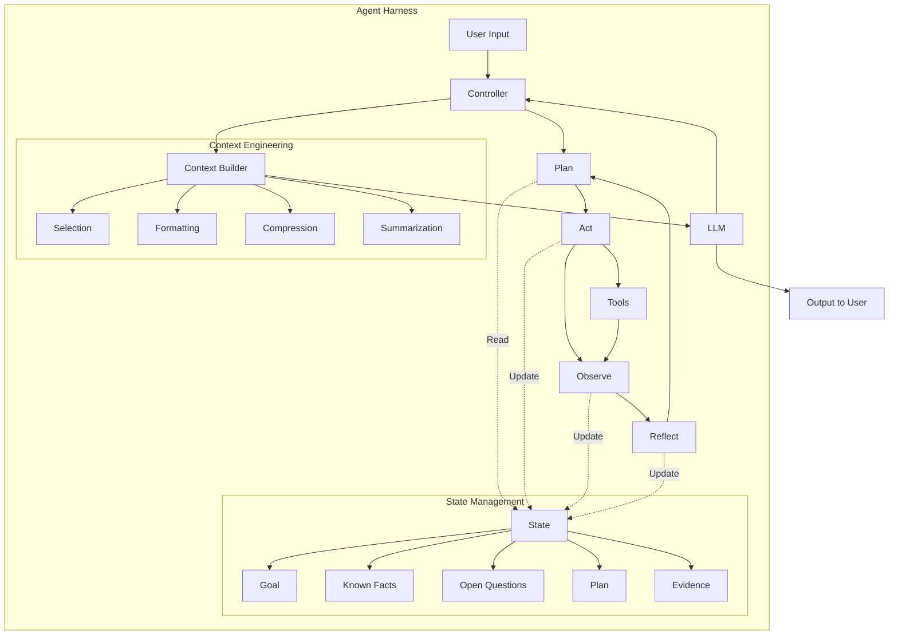
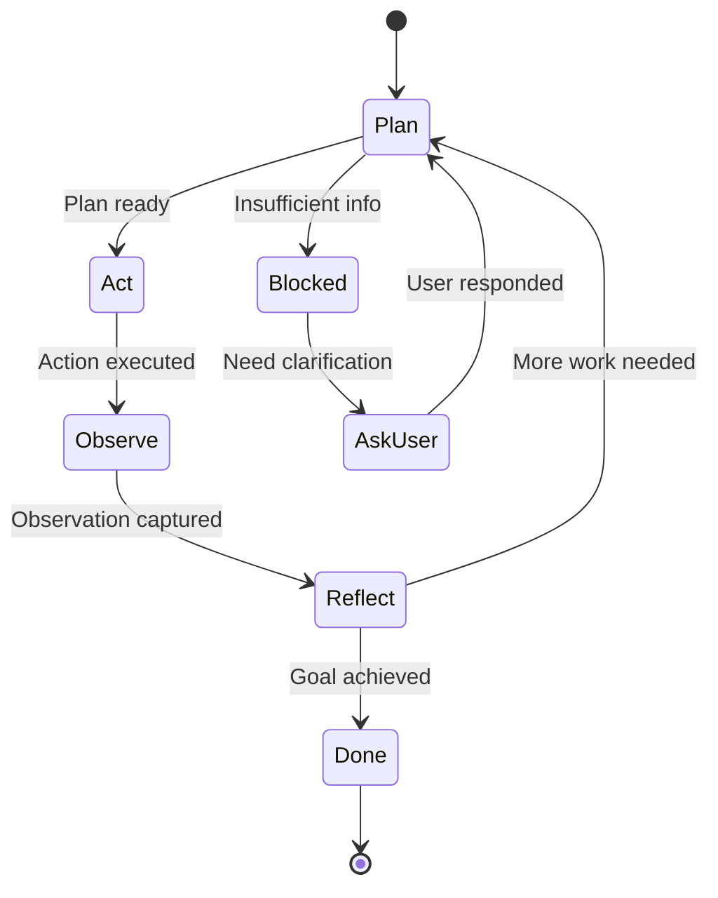

# Claude風エージェントアーキテクチャ

## 概要

このドキュメントでは、Claude的な動作を実現するための**Agent Harness**（エージェント実行基盤）の設計を解説します。

Agent Harnessとは、LLM単体ではなく、**実行ループ・状態管理・ツール統合・コンテキスト構築を含む全体システム**を指します。

---

## 🏗️ Agent Harnessの全体像

### アーキテクチャ図



### コンポーネント

| コンポーネント | 役割 |
|-------------|------|
| **Controller** | 実行ループの制御 |
| **State** | エージェントの状態を保持 |
| **Context Builder** | LLMへのコンテキストを構築 |
| **LLM** | 推論エンジン |
| **Tools** | 外部ツール群 |
| **Plan-Act-Observe-Reflect** | 思考サイクル |

---

## 📋 Stateスキーマ設計

エージェントの「状態」を明確に定義します。

### 基本スキーマ

```typescript
interface AgentState {
  // 目標
  goal: string
  originalGoal: string  // 初期目標（変更されない）

  // 知識
  knownFacts: Fact[]
  openQuestions: Question[]

  // 計画
  plan: Plan
  currentStep: number

  // 観測
  observations: Observation[]
  toolResults: ToolResult[]

  // メタ情報
  startTime: number
  iterationCount: number
  status: 'planning' | 'executing' | 'blocked' | 'completed' | 'failed'

  // コンテキスト管理
  conversationHistory: Message[]
  summaries: Summary[]
}

interface Fact {
  id: string
  content: string
  source: 'user' | 'tool' | 'inference'
  confidence: 'high' | 'medium' | 'low'
  timestamp: number
}

interface Question {
  id: string
  question: string
  priority: 'high' | 'medium' | 'low'
  blocksProgress: boolean
}

interface Plan {
  steps: PlanStep[]
  strategy: string
  alternatives: string[]
}

interface PlanStep {
  id: string
  description: string
  status: 'pending' | 'in_progress' | 'completed' | 'failed' | 'skipped'
  dependencies: string[]  // 他のstepのID
  result?: string
}

interface Observation {
  id: string
  source: string  // ツール名
  content: string
  timestamp: number
  relevance: number  // 0-1
}
```

### State初期化

```typescript
function initializeState(userGoal: string): AgentState {
  return {
    goal: userGoal,
    originalGoal: userGoal,

    knownFacts: [],
    openQuestions: [],

    plan: {
      steps: [],
      strategy: '',
      alternatives: []
    },
    currentStep: 0,

    observations: [],
    toolResults: [],

    startTime: Date.now(),
    iterationCount: 0,
    status: 'planning',

    conversationHistory: [],
    summaries: []
  }
}
```

---

## 🔄 Plan-Act-Observe-Reflectサイクル

Claudeの思考パターンを模倣します。

### 全体フロー



### 1. Plan（計画）

目標を達成するための計画を立てます。

```typescript
async function planPhase(state: AgentState): Promise<AgentState> {
  const context = await buildPlanningContext(state)

  const planningPrompt = `
<goal>
${state.goal}
</goal>

<known_facts>
${state.knownFacts.map(f => `<fact source="${f.source}" confidence="${f.confidence}">${f.content}</fact>`).join('\n')}
</known_facts>

<open_questions>
${state.openQuestions.map(q => `<question priority="${q.priority}">${q.question}</question>`).join('\n')}
</open_questions>

タスク: 上記の目標を達成するための詳細な計画を立ててください。

計画には以下を含めてください：
1. 実行すべきステップ（順序付き）
2. 各ステップで使用するツール
3. 依存関係
4. 代替戦略（もしあれば）

以下の形式で出力してください：
<plan>
  <strategy>全体戦略の説明</strategy>
  <steps>
    <step id="1" depends_on="">ステップ1の説明</step>
    <step id="2" depends_on="1">ステップ2の説明</step>
    ...
  </steps>
  <alternatives>
    代替案があれば記載
  </alternatives>
</plan>
`

  const response = await llm.generate(planningPrompt)
  const plan = parsePlan(response)

  return {
    ...state,
    plan,
    status: 'executing',
    currentStep: 0
  }
}

function parsePlan(response: string): Plan {
  // XMLパース
  const strategy = extractTag(response, 'strategy')
  const stepsXml = extractTag(response, 'steps')
  const alternatives = extractTag(response, 'alternatives')

  const steps = parseSteps(stepsXml)

  return {
    strategy,
    steps,
    alternatives: alternatives ? [alternatives] : []
  }
}
```

### 2. Act（実行）

計画に基づいてアクションを実行します。

```typescript
async function actPhase(state: AgentState): Promise<AgentState> {
  const currentStep = state.plan.steps[state.currentStep]

  if (!currentStep) {
    return {
      ...state,
      status: 'completed'
    }
  }

  // 依存関係チェック
  const dependenciesMet = currentStep.dependencies.every(depId => {
    const dep = state.plan.steps.find(s => s.id === depId)
    return dep?.status === 'completed'
  })

  if (!dependenciesMet) {
    return {
      ...state,
      status: 'blocked'
    }
  }

  // アクション実行の判断
  const context = await buildActionContext(state, currentStep)

  const actionPrompt = `
<current_step>
${currentStep.description}
</current_step>

<available_tools>
${formatTools(availableTools)}
</available_tools>

<observations>
${formatObservations(state.observations)}
</observations>

タスク: このステップを実行するために、適切なアクションを選択してください。

以下のいずれかを選んでください：
1. ツールを使用する（どのツールをどう使うか明示）
2. 情報が十分なので、ツール不要で進める
3. 情報が不足しているので、ユーザーに質問する

<action>タグで回答してください。
`

  const response = await llm.generate(actionPrompt)
  const action = parseAction(response)

  // アクション実行
  let newState = state

  if (action.type === 'use_tool') {
    const result = await executeTool(action.tool, action.params)
    newState = {
      ...state,
      toolResults: [...state.toolResults, result],
      observations: [
        ...state.observations,
        {
          id: generateId(),
          source: action.tool,
          content: result.output,
          timestamp: Date.now(),
          relevance: 1.0
        }
      ]
    }
  } else if (action.type === 'no_tool_needed') {
    // ステップを完了としてマーク
    newState = updateStepStatus(state, currentStep.id, 'completed')
  } else if (action.type === 'ask_user') {
    newState = {
      ...state,
      status: 'blocked',
      openQuestions: [
        ...state.openQuestions,
        {
          id: generateId(),
          question: action.question,
          priority: 'high',
          blocksProgress: true
        }
      ]
    }
  }

  return newState
}
```

### 3. Observe（観察）

アクションの結果を観察し、記録します。

```typescript
async function observePhase(state: AgentState): Promise<AgentState> {
  // 最新の観測を取得
  const latestObservation = state.observations[state.observations.length - 1]

  if (!latestObservation) {
    return state
  }

  // 観測結果の解釈
  const interpretationPrompt = `
<observation>
Source: ${latestObservation.source}
Content: ${latestObservation.content}
</observation>

<current_goal>
${state.goal}
</current_goal>

<current_step>
${state.plan.steps[state.currentStep]?.description}
</current_step>

タスク: この観測結果を解釈してください。

以下を明示してください：
1. 新たに判明した事実（high/medium/low confidence）
2. 生じた新しい疑問
3. 現在のステップへの影響（completed/needs_more/failed）

<interpretation>タグで回答してください。
`

  const response = await llm.generate(interpretationPrompt)
  const interpretation = parseInterpretation(response)

  // 状態を更新
  let newState = {
    ...state,
    knownFacts: [
      ...state.knownFacts,
      ...interpretation.newFacts
    ],
    openQuestions: [
      ...state.openQuestions,
      ...interpretation.newQuestions
    ]
  }

  // ステップのステータス更新
  if (interpretation.stepImpact === 'completed') {
    newState = updateStepStatus(
      newState,
      state.plan.steps[state.currentStep].id,
      'completed'
    )
    newState.currentStep += 1
  } else if (interpretation.stepImpact === 'failed') {
    newState = updateStepStatus(
      newState,
      state.plan.steps[state.currentStep].id,
      'failed'
    )
    newState.status = 'planning' // 再計画
  }

  return newState
}
```

### 4. Reflect（反省）

進捗を評価し、次のアクションを決定します。

```typescript
async function reflectPhase(state: AgentState): Promise<AgentState> {
  const reflectionPrompt = `
<original_goal>
${state.originalGoal}
</original_goal>

<current_plan>
Strategy: ${state.plan.strategy}
Progress: ${state.currentStep} / ${state.plan.steps.length} steps
</current_plan>

<known_facts>
${state.knownFacts.map(f => `- ${f.content} (${f.confidence})`).join('\n')}
</known_facts>

<open_questions>
${state.openQuestions.map(q => `- ${q.question} (${q.priority})`).join('\n')}
</open_questions>

タスク: 現在の進捗を評価してください。

以下を判断してください：
1. 目標は達成されたか？（yes/no/partial）
2. 現在の計画は有効か？（yes/no/needs_revision）
3. 次に何をすべきか？（continue/replan/ask_user/done）

<reflection>タグで回答してください。
`

  const response = await llm.generate(reflectionPrompt)
  const reflection = parseReflection(response)

  let newState = state

  if (reflection.goalAchieved === 'yes') {
    newState = {
      ...state,
      status: 'completed'
    }
  } else if (reflection.planValidity === 'no' || reflection.planValidity === 'needs_revision') {
    newState = {
      ...state,
      status: 'planning', // 再計画
      plan: {
        ...state.plan,
        steps: [] // リセット
      },
      currentStep: 0
    }
  } else if (reflection.nextAction === 'ask_user') {
    newState = {
      ...state,
      status: 'blocked'
    }
  } else {
    newState = {
      ...state,
      status: 'executing'
    }
  }

  newState.iterationCount += 1

  return newState
}
```

---

## 🔧 Controllerの実装

全体の実行ループを管理します。

```typescript
class AgentController {
  private state: AgentState
  private contextBuilder: ContextBuilder
  private maxIterations: number = 50

  constructor(
    initialGoal: string,
    contextBuilder: ContextBuilder
  ) {
    this.state = initializeState(initialGoal)
    this.contextBuilder = contextBuilder
  }

  async run(): Promise<AgentState> {
    while (
      this.state.status !== 'completed' &&
      this.state.status !== 'failed' &&
      this.state.iterationCount < this.maxIterations
    ) {
      switch (this.state.status) {
        case 'planning':
          this.state = await planPhase(this.state)
          break

        case 'executing':
          this.state = await actPhase(this.state)
          this.state = await observePhase(this.state)
          this.state = await reflectPhase(this.state)
          break

        case 'blocked':
          // ユーザー入力を待つ
          await this.waitForUserInput()
          break
      }

      // コンテキスト管理
      this.state = await this.manageContext(this.state)

      // 進捗レポート
      this.reportProgress(this.state)
    }

    if (this.state.iterationCount >= this.maxIterations) {
      this.state.status = 'failed'
      console.error('Max iterations reached')
    }

    return this.state
  }

  private async manageContext(
    state: AgentState
  ): Promise<AgentState> {
    // トークン数チェック
    const tokens = await this.contextBuilder.countTokens(state)

    if (tokens > CONTEXT_THRESHOLD) {
      // 古い観測を削除
      state.observations = state.observations.filter(
        o => Date.now() - o.timestamp < 600000 // 10分
      )

      // 履歴を要約
      if (state.conversationHistory.length > 10) {
        const summary = await this.summarizeHistory(
          state.conversationHistory.slice(0, -5)
        )

        state.summaries.push(summary)
        state.conversationHistory = state.conversationHistory.slice(-5)
      }
    }

    return state
  }

  private async waitForUserInput(): Promise<void> {
    // UIに質問を表示
    const questions = this.state.openQuestions.filter(
      q => q.blocksProgress
    )

    for (const question of questions) {
      const answer = await this.askUser(question.question)

      // 回答を事実として記録
      this.state.knownFacts.push({
        id: generateId(),
        content: answer,
        source: 'user',
        confidence: 'high',
        timestamp: Date.now()
      })

      // 質問を解決済みに
      this.state.openQuestions = this.state.openQuestions.filter(
        q => q.id !== question.id
      )
    }

    // ブロック解除
    if (this.state.openQuestions.filter(q => q.blocksProgress).length === 0) {
      this.state.status = 'executing'
    }
  }

  private reportProgress(state: AgentState): void {
    console.log(`
Iteration: ${state.iterationCount}
Status: ${state.status}
Progress: ${state.currentStep} / ${state.plan.steps.length}
Known facts: ${state.knownFacts.length}
Open questions: ${state.openQuestions.length}
`)
  }
}
```

---

## 🛠️ ツール統合

ツールの定義と実行メカニズムです。

### ツール定義

```typescript
interface Tool {
  name: string
  description: string
  parameters: ToolParameter[]
  execute: (params: any) => Promise<ToolResult>
}

interface ToolParameter {
  name: string
  type: 'string' | 'number' | 'boolean' | 'object'
  description: string
  required: boolean
}

interface ToolResult {
  success: boolean
  output: string
  error?: string
  metadata?: Record<string, any>
}
```

### ツール実装例

```typescript
const searchTool: Tool = {
  name: 'web_search',
  description: 'Search the web for information',
  parameters: [
    {
      name: 'query',
      type: 'string',
      description: 'Search query',
      required: true
    },
    {
      name: 'max_results',
      type: 'number',
      description: 'Maximum number of results',
      required: false
    }
  ],
  execute: async (params) => {
    try {
      const results = await performWebSearch(
        params.query,
        params.max_results || 5
      )

      return {
        success: true,
        output: JSON.stringify(results, null, 2)
      }
    } catch (error) {
      return {
        success: false,
        output: '',
        error: error.message
      }
    }
  }
}

const fileReadTool: Tool = {
  name: 'read_file',
  description: 'Read contents of a file',
  parameters: [
    {
      name: 'path',
      type: 'string',
      description: 'File path',
      required: true
    }
  ],
  execute: async (params) => {
    try {
      const content = await fs.readFile(params.path, 'utf-8')

      return {
        success: true,
        output: content
      }
    } catch (error) {
      return {
        success: false,
        output: '',
        error: `Failed to read file: ${error.message}`
      }
    }
  }
}
```

### ツール選択ロジック

```typescript
async function selectTool(
  task: string,
  availableTools: Tool[]
): Promise<Tool | null> {
  const toolDescriptions = availableTools
    .map(t => `${t.name}: ${t.description}`)
    .join('\n')

  const prompt = `
<task>
${task}
</task>

<available_tools>
${toolDescriptions}
</available_tools>

タスク: このタスクを実行するために最適なツールを選択してください。

ツールが不要な場合は "none" と答えてください。
必要な場合は、ツール名とパラメータを指定してください。

<tool_selection>
  <tool>ツール名 or none</tool>
  <params>パラメータ（JSON形式）</params>
  <reason>選択理由</reason>
</tool_selection>
`

  const response = await llm.generate(prompt)
  const selection = parseToolSelection(response)

  if (selection.tool === 'none') {
    return null
  }

  return availableTools.find(t => t.name === selection.tool) || null
}
```

---

## ✅ 停止条件と完了判定

エージェントをいつ停止すべきか判断します。

### 完了判定ロジック

```typescript
function isTaskCompleted(state: AgentState): boolean {
  // 1. 明示的な完了
  if (state.status === 'completed') {
    return true
  }

  // 2. すべてのステップが完了
  const allStepsCompleted = state.plan.steps.every(
    step => step.status === 'completed' || step.status === 'skipped'
  )

  if (allStepsCompleted) {
    return true
  }

  // 3. LLMによる判定
  return false
}

async function checkGoalAchievement(
  state: AgentState
): Promise<boolean> {
  const prompt = `
<original_goal>
${state.originalGoal}
</original_goal>

<known_facts>
${state.knownFacts.map(f => `- ${f.content}`).join('\n')}
</known_facts>

<completed_steps>
${state.plan.steps.filter(s => s.status === 'completed').map(s => `- ${s.description}: ${s.result}`).join('\n')}
</completed_steps>

質問: 元の目標は達成されましたか？

"yes", "no", "partial" のいずれかで答えてください。理由も述べてください。
`

  const response = await llm.generate(prompt)

  return response.toLowerCase().includes('yes')
}
```

---

## 📚 参考資料

### 関連ドキュメント

- [01-claude-design-philosophy.md](./01-claude-design-philosophy.md) - 設計思想
- [02-context-engineering.md](./02-context-engineering.md) - Context Engineering
- [04-implementation-guide.md](./04-implementation-guide.md) - LangGraphでの実装

---

**次**: [04-implementation-guide.md](./04-implementation-guide.md) - OSSツールを使った具体的な実装手順
