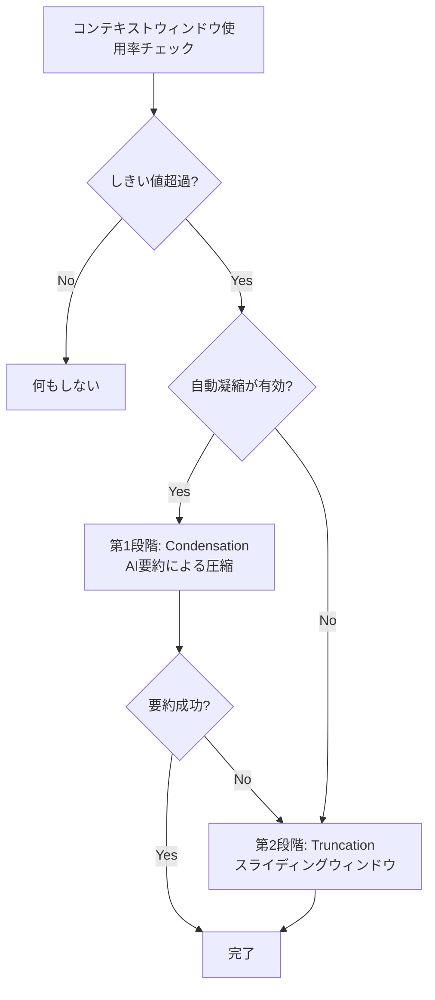
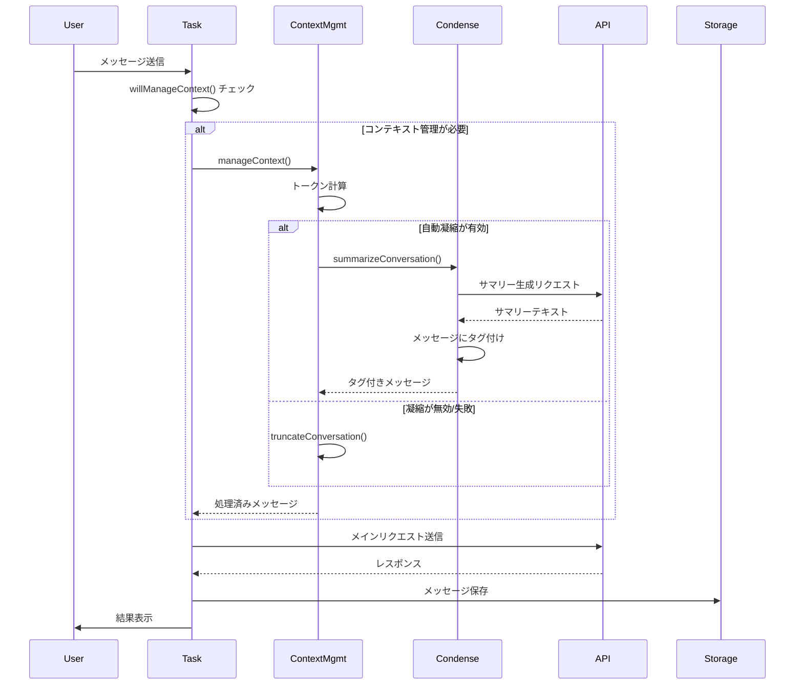
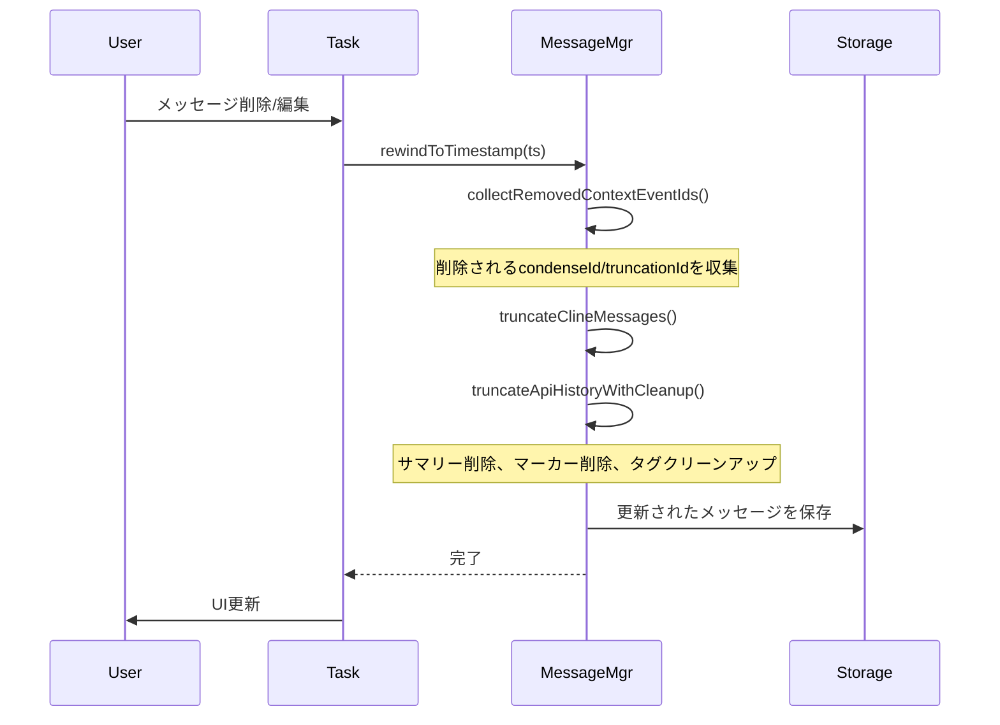

# Roo Code コンテキスト管理システム - 概要

## 目次
1. [はじめに](#はじめに)
2. [コンテキスト管理の課題](#コンテキスト管理の課題)
3. [Roo Codeのアプローチ](#roo-codeのアプローチ)
4. [アーキテクチャ概要](#アーキテクチャ概要)
5. [主要コンポーネント](#主要コンポーネント)
6. [データフロー](#データフロー)

---

## はじめに

Roo Codeは、Claude AIを使用したコーディングアシスタントツールです。長時間の会話セッションでは、LLMのコンテキストウィンドウ（トークン制限）が問題になります。このドキュメントでは、Roo Codeが実装している高度なコンテキスト管理システムについて詳細に解説します。

### このドキュメントの対象読者
- Roo Codeの内部実装を理解したい開発者
- 同様のコンテキスト管理機能を実装したい開発者
- LLMベースのアプリケーション開発者

---

## コンテキスト管理の課題

### LLMのコンテキストウィンドウ制限

すべてのLLMには、一度に処理できるトークン数に上限があります：

- **Claude Sonnet**: 200,000トークン
- **Claude Opus**: 200,000トークン
- **GPT-4**: 128,000トークン（モデルによる）

長時間の会話では、この制限を超えてしまう可能性があります。

### ナイーブな解決策の問題点

**単純な削除**:
```typescript
// ❌ 悪い例：古いメッセージを単純に削除
if (tokenCount > limit) {
  messages = messages.slice(-100) // 最新100件だけ保持
}
```

**問題点**:
- 重要な文脈情報が失われる
- ユーザーが過去の会話を参照できなくなる
- チェックポイント機能との互換性がない
- 元に戻す（rewind）操作ができない

---

## Roo Codeのアプローチ

Roo Codeは、**二段階の非破壊的コンテキスト管理**を採用しています。

### 設計原則

1. **非破壊的**: メッセージを物理的に削除しない
2. **可逆的**: いつでも過去の状態に戻せる
3. **知的な圧縮**: AIを使った要約で情報損失を最小化
4. **段階的なフォールバック**: 要約→トランケーションの順で適用

### 二段階アプローチ



#### 第1段階: Condensation（凝縮）

**メカニズム**: LLMを使って会話を要約し、複数のメッセージを1つのサマリーメッセージに置き換えます。

**利点**:
- 重要な情報を保持
- 大幅なトークン削減（通常70-90%）
- 文脈の連続性を維持

**コスト**: LLM API呼び出しが必要

#### 第2段階: Truncation（トランケーション）

**メカニズム**: スライディングウィンドウ方式で古いメッセージを隠します。

**利点**:
- 追加コストなし
- 確実にトークンを削減
- 実装がシンプル

**欠点**: 情報が失われる（ただし非破壊的なので復元可能）

---

## アーキテクチャ概要

### レイヤー構造

```
┌─────────────────────────────────────────────┐
│          UI Layer (Webview)                  │
│  - ContextWindowProgress                     │
│  - CondensationResultRow                     │
│  - TruncationResultRow                       │
└─────────────────────────────────────────────┘
                    ↓ Events
┌─────────────────────────────────────────────┐
│          Task Layer                          │
│  - Task.ts                                   │
│  - MessageManager                            │
└─────────────────────────────────────────────┘
                    ↓ API Calls
┌─────────────────────────────────────────────┐
│     Context Management Layer                 │
│  - manageContext()                           │
│  - willManageContext()                       │
│  - estimateTokenCount()                      │
└─────────────────────────────────────────────┘
         ↓                           ↓
┌──────────────────┐      ┌──────────────────┐
│  Condensation    │      │   Truncation     │
│  - summarize     │      │   - truncate     │
│  - getKeep       │      │   - tag messages │
└──────────────────┘      └──────────────────┘
                    ↓
┌─────────────────────────────────────────────┐
│         Persistence Layer                    │
│  - readApiMessages()                         │
│  - saveApiMessages()                         │
└─────────────────────────────────────────────┘
```

---

## 主要コンポーネント

### 1. コンテキスト管理コア

**ファイル**: [`src/core/context-management/index.ts`](../../src/core/context-management/index.ts)

**主要関数**:

| 関数 | 説明 |
|------|------|
| `manageContext()` | コンテキスト管理のメインエントリーポイント |
| `willManageContext()` | コンテキスト管理が実行されるかを事前チェック |
| `truncateConversation()` | スライディングウィンドウトランケーション |
| `estimateTokenCount()` | トークン数の推定 |

**重要な定数**:
```typescript
// 10%のバッファを予約（コンテキストウィンドウの90%まで使用）
export const TOKEN_BUFFER_PERCENTAGE = 0.1
```

### 2. 凝縮（Condensation）モジュール

**ファイル**: [`src/core/condense/index.ts`](../../src/core/condense/index.ts)

**主要関数**:

| 関数 | 説明 |
|------|------|
| `summarizeConversation()` | LLMを使って会話を要約 |
| `getMessagesSinceLastSummary()` | 最後のサマリー以降のメッセージを取得 |
| `getEffectiveApiHistory()` | 有効なAPI履歴をフィルタリング |
| `cleanupAfterTruncation()` | 孤立したタグのクリーンアップ |
| `getKeepMessagesWithToolBlocks()` | ツールブロックを保持したメッセージ抽出 |

**重要な定数**:
```typescript
export const N_MESSAGES_TO_KEEP = 3              // 常に保持する最新メッセージ数
export const MIN_CONDENSE_THRESHOLD = 5          // 最小しきい値 5%
export const MAX_CONDENSE_THRESHOLD = 100        // 最大しきい値 100%
```

### 3. メッセージマネージャー

**ファイル**: [`src/core/message-manager/index.ts`](../../src/core/message-manager/index.ts)

**責務**: 会話の巻き戻し操作を一元管理

**主要メソッド**:

| メソッド | 説明 |
|---------|------|
| `rewindToTimestamp()` | タイムスタンプ指定での巻き戻し |
| `rewindToIndex()` | インデックス指定での巻き戻し |
| `performRewind()` | 内部的な巻き戻し実行 |

### 4. タスク永続化

**ファイル**: [`src/core/task-persistence/apiMessages.ts`](../../src/core/task-persistence/apiMessages.ts)

**主要型**:
```typescript
export type ApiMessage = Anthropic.MessageParam & {
  ts?: number                    // タイムスタンプ
  isSummary?: boolean            // サマリーメッセージフラグ
  condenseId?: string            // サマリーの一意識別子
  condenseParent?: string        // 親サマリーへの参照
  truncationId?: string          // トランケーションマーカーID
  truncationParent?: string      // トランケーションマーカーへの参照
  isTruncationMarker?: boolean   // トランケーションマーカーフラグ
}
```

### 5. トークンカウンティング

**ファイル**: [`src/utils/tiktoken.ts`](../../src/utils/tiktoken.ts)

**主要関数**: `tiktoken()`

**特徴**:
- `o200k_base` エンコーダー使用
- テキスト、画像、tool_use、tool_resultブロックをサポート
- 誤差調整係数: `TOKEN_FUDGE_FACTOR = 1.5`

---

## データフロー

### 通常のメッセージ送信フロー



### 巻き戻し（Rewind）フロー



---

## 非破壊的管理の仕組み

### メッセージのライフサイクル

#### 1. 通常のメッセージ
```typescript
{
  role: "user",
  content: "Hello",
  ts: 1000
}
```

#### 2. 凝縮後
```typescript
// 元のメッセージ（タグ付けされるが削除されない）
{
  role: "user",
  content: "Hello",
  ts: 1000,
  condenseParent: "uuid-123"  // ← このサマリーに置き換えられた
}

// サマリーメッセージ（新規追加）
{
  role: "assistant",
  content: [
    { type: "reasoning", text: "Condensing conversation context..." },
    { type: "text", text: "サマリーテキスト..." }
  ],
  ts: 2999,
  isSummary: true,
  condenseId: "uuid-123"  // ← 一意識別子
}
```

#### 3. API送信時のフィルタリング

**`getEffectiveApiHistory()`** がフィルタリングを実行:

```typescript
// 実際のメッセージ配列
[
  msg1,                           // condenseParent なし → 送信
  msg2(condenseParent="uuid-123"), // condenseParent あり → フィルタ
  msg3(condenseParent="uuid-123"), // condenseParent あり → フィルタ
  summary(condenseId="uuid-123"),  // サマリー → 送信
  msg4                            // condenseParent なし → 送信
]

// API送信時（フィルタ後）
[
  msg1,
  summary(condenseId="uuid-123"),
  msg4
]
```

#### 4. 巻き戻し後

サマリーが削除されると、`cleanupAfterTruncation()` が孤立したタグをクリーンアップ:

```typescript
// サマリー削除前
[
  msg1,
  msg2(condenseParent="uuid-123"),
  msg3(condenseParent="uuid-123"),
  summary(condenseId="uuid-123"),  // ← これが削除される
  msg4
]

// cleanupAfterTruncation() 実行後
[
  msg1,
  msg2,  // condenseParent が削除された → 復元
  msg3,  // condenseParent が削除された → 復元
  msg4
]
```

### トランケーションも同様の仕組み

```typescript
// トランケーション前
[msg1, msg2, msg3, msg4, msg5]

// トランケーション後（50%削除）
[
  msg1,  // 最初のメッセージは常に保持
  msg2(truncationParent="uuid-456"),  // タグ付け
  msg3(truncationParent="uuid-456"),  // タグ付け
  truncationMarker(truncationId="uuid-456"),  // マーカー挿入
  msg4,
  msg5
]

// API送信時（getEffectiveApiHistory後）
[msg1, truncationMarker, msg4, msg5]
```

---

## 次のステップ

より詳細な実装について学ぶには、以下のドキュメントをご覧ください：

- [**02-implementation.md**](./02-implementation.md) - 実装の詳細とコード例
- [**03-api-reference.md**](./03-api-reference.md) - 関数とクラスのAPIリファレンス
- [**04-advanced-topics.md**](./04-advanced-topics.md) - 高度なトピック（ツールブロック保持、チェックポイント統合など）

---

## 参考リソース

### ソースコード
- [コンテキスト管理コア](../../src/core/context-management/index.ts)
- [凝縮モジュール](../../src/core/condense/index.ts)
- [メッセージマネージャー](../../src/core/message-manager/index.ts)
- [タスク永続化](../../src/core/task-persistence/apiMessages.ts)

### テストファイル
- [コンテキスト管理テスト](../../src/core/context-management/__tests__/context-management.spec.ts)
- [凝縮テスト](../../src/core/condense/__tests__/condense.spec.ts)
- [巻き戻しテスト](../../src/core/condense/__tests__/rewind-after-condense.spec.ts)
