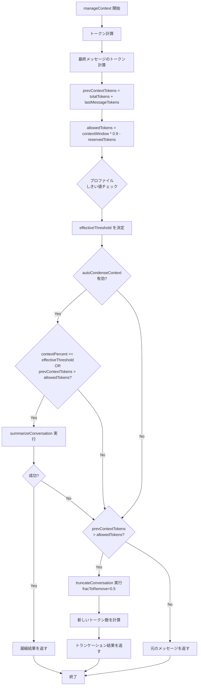
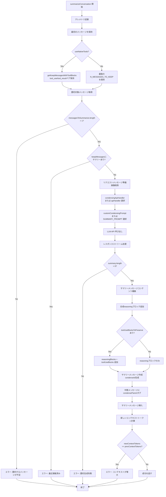
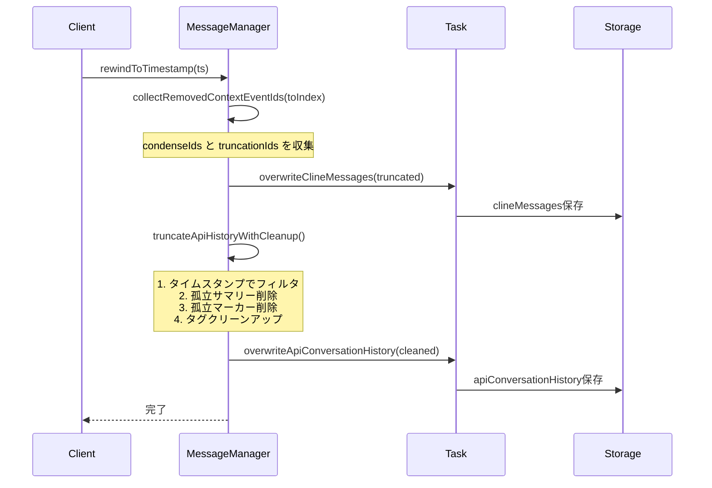

# Roo Code コンテキスト管理システム - 実装詳細

## 目次
1. [manageContext() 関数の詳細](#managecontext-関数の詳細)
2. [Condensation（凝縮）の実装](#condensation凝縮の実装)
3. [Truncation（トランケーション）の実装](#truncationトランケーションの実装)
4. [MessageManagerの実装](#messagemanagerの実装)
5. [トークンカウンティングの実装](#トークンカウンティングの実装)
6. [実装例とベストプラクティス](#実装例とベストプラクティス)

---

## manageContext() 関数の詳細

### 関数シグネチャ

**ファイル**: [`src/core/context-management/index.ts:238-359`](../../src/core/context-management/index.ts#L238-L359)

```typescript
export type ContextManagementOptions = {
  messages: ApiMessage[]
  totalTokens: number
  contextWindow: number
  maxTokens?: number | null
  apiHandler: ApiHandler
  autoCondenseContext: boolean
  autoCondenseContextPercent: number
  systemPrompt: string
  taskId: string
  customCondensingPrompt?: string
  condensingApiHandler?: ApiHandler
  profileThresholds: Record<string, number>
  currentProfileId: string
  useNativeTools?: boolean
}

export type ContextManagementResult = SummarizeResponse & {
  prevContextTokens: number
  truncationId?: string
  messagesRemoved?: number
  newContextTokensAfterTruncation?: number
}

export async function manageContext(
  options: ContextManagementOptions
): Promise<ContextManagementResult>
```

### 処理フロー



### 実装の詳細

#### 1. トークン計算

```typescript
// 予約トークン（レスポンス用）
const reservedTokens = maxTokens || ANTHROPIC_DEFAULT_MAX_TOKENS

// 最後のメッセージのトークン数を推定
const lastMessage = messages[messages.length - 1]
const lastMessageContent = lastMessage.content
const lastMessageTokens = Array.isArray(lastMessageContent)
  ? await estimateTokenCount(lastMessageContent, apiHandler)
  : await estimateTokenCount([{ type: "text", text: lastMessageContent }], apiHandler)

// 現在の総トークン数
const prevContextTokens = totalTokens + lastMessageTokens

// 許可されるトークン数（10%バッファ）
const allowedTokens = contextWindow * (1 - TOKEN_BUFFER_PERCENTAGE) - reservedTokens
```

**重要**:
- `totalTokens` は最後のメッセージを**含まない**
- `lastMessageTokens` を別途計算して加算
- `TOKEN_BUFFER_PERCENTAGE = 0.1` でコンテキストウィンドウの90%まで使用

#### 2. プロファイル別しきい値の決定

```typescript
let effectiveThreshold = autoCondenseContextPercent
const profileThreshold = profileThresholds[currentProfileId]

if (profileThreshold !== undefined) {
  if (profileThreshold === -1) {
    // -1 は親設定を継承
    effectiveThreshold = autoCondenseContextPercent
  } else if (
    profileThreshold >= MIN_CONDENSE_THRESHOLD &&
    profileThreshold <= MAX_CONDENSE_THRESHOLD
  ) {
    // 有効なカスタムしきい値
    effectiveThreshold = profileThreshold
  } else {
    // 無効な値の場合、グローバル設定にフォールバック
    console.warn(
      `Invalid profile threshold ${profileThreshold} for profile "${currentProfileId}". ` +
      `Using global default of ${autoCondenseContextPercent}%`
    )
    effectiveThreshold = autoCondenseContextPercent
  }
}
```

**設計パターン**:
- グローバル設定 + プロファイル別オーバーライド
- `-1` で親設定継承（階層的設定）
- 無効な値のフォールバック処理

#### 3. 凝縮の試行

```typescript
if (autoCondenseContext) {
  const contextPercent = (100 * prevContextTokens) / contextWindow

  if (contextPercent >= effectiveThreshold || prevContextTokens > allowedTokens) {
    const result = await summarizeConversation(
      messages,
      apiHandler,
      systemPrompt,
      taskId,
      prevContextTokens,
      true,  // automatic trigger
      customCondensingPrompt,
      condensingApiHandler,
      useNativeTools
    )

    if (result.error) {
      error = result.error
      cost = result.cost
      // フォールスルーしてトランケーションへ
    } else {
      return { ...result, prevContextTokens }
    }
  }
}
```

**条件**:
1. `contextPercent >= effectiveThreshold` (例: 75%)
2. または `prevContextTokens > allowedTokens`

#### 4. トランケーションへのフォールバック

```typescript
if (prevContextTokens > allowedTokens) {
  const truncationResult = truncateConversation(messages, 0.5, taskId)

  // 新しいコンテキストトークン数を計算
  const effectiveMessages = truncationResult.messages.filter(
    (msg) => !msg.truncationParent && !msg.isTruncationMarker
  )

  let newContextTokensAfterTruncation = await estimateTokenCount(
    [{ type: "text", text: systemPrompt }],
    apiHandler
  )

  for (const msg of effectiveMessages) {
    const content = msg.content
    if (Array.isArray(content)) {
      newContextTokensAfterTruncation += await estimateTokenCount(content, apiHandler)
    } else if (typeof content === "string") {
      newContextTokensAfterTruncation += await estimateTokenCount(
        [{ type: "text", text: content }],
        apiHandler
      )
    }
  }

  return {
    messages: truncationResult.messages,
    prevContextTokens,
    summary: "",
    cost,
    error,
    truncationId: truncationResult.truncationId,
    messagesRemoved: truncationResult.messagesRemoved,
    newContextTokensAfterTruncation
  }
}
```

**注意点**:
- トランケーション後のトークン数を再計算
- システムプロンプトのトークンも含める
- フィルタリング後のメッセージのみカウント

---

## Condensation（凝縮）の実装

### summarizeConversation() 関数

**ファイル**: [`src/core/condense/index.ts:182-397`](../../src/core/condense/index.ts#L182-L397)

### 処理フロー



### 実装の詳細

#### 1. 保持するメッセージの決定

```typescript
// 最初のメッセージは常に保持（スラッシュコマンド内容含む可能性のため）
const firstMessage = messages[0]

// Native Tools使用時はtool_use/tool_resultペアを保持
const { keepMessages, toolUseBlocksToPreserve, reasoningBlocksToPreserve } = useNativeTools
  ? getKeepMessagesWithToolBlocks(messages, N_MESSAGES_TO_KEEP)
  : {
      keepMessages: messages.slice(-N_MESSAGES_TO_KEEP),
      toolUseBlocksToPreserve: [],
      reasoningBlocksToPreserve: []
    }
```

**`N_MESSAGES_TO_KEEP = 3`** の理由:
- 最低限の会話文脈を保持
- 直近のユーザー要求を確実に保持
- tool_use/tool_resultペアが分断されないように

#### 2. tool_use/tool_resultペアの保持

**ファイル**: [`src/core/condense/index.ts:73-103`](../../src/core/condense/index.ts#L73-L103)

```typescript
export function getKeepMessagesWithToolBlocks(
  messages: ApiMessage[],
  keepCount: number
): KeepMessagesResult {
  if (messages.length <= keepCount) {
    return { keepMessages: messages, toolUseBlocksToPreserve: [], reasoningBlocksToPreserve: [] }
  }

  const startIndex = messages.length - keepCount
  const keepMessages = messages.slice(startIndex)

  // 最初の保持メッセージがtool_resultを含むユーザーメッセージか確認
  if (keepMessages.length > 0 && hasToolResultBlocks(keepMessages[0])) {
    // 直前のアシスタントメッセージからtool_useブロックを取得
    const precedingIndex = startIndex - 1
    if (precedingIndex >= 0) {
      const precedingMessage = messages[precedingIndex]
      const toolUseBlocks = getToolUseBlocks(precedingMessage)
      if (toolUseBlocks.length > 0) {
        // DeepSeek/Z.ai用のreasoningブロックも取得
        const reasoningBlocks = getReasoningBlocks(precedingMessage)
        return {
          keepMessages,
          toolUseBlocksToPreserve: toolUseBlocks,
          reasoningBlocksToPreserve: reasoningBlocks
        }
      }
    }
  }

  return { keepMessages, toolUseBlocksToPreserve: [], reasoningBlocksToPreserve: [] }
}
```

**なぜ必要か**:

Native Toolsプロトコルでは、`tool_result`には対応する`tool_use`が**必須**です：

```
Bad:
[summary, user(tool_result)]  ❌ tool_useがない

Good:
[summary(with tool_use blocks), user(tool_result)]  ✅
```

DeepSeek/Z.aiは`reasoning_content`も必須：

```typescript
// DeepSeek API エラー例:
// "400 Missing reasoning_content field in the assistant message"
```

#### 3. サマリー生成リクエスト

```typescript
const finalRequestMessage: Anthropic.MessageParam = {
  role: "user",
  content: "Summarize the conversation so far, as described in the prompt instructions."
}

const requestMessages = maybeRemoveImageBlocks(
  [...messagesToSummarize, finalRequestMessage],
  apiHandler
).map(({ role, content }) => ({ role, content }))

const promptToUse = customCondensingPrompt?.trim()
  ? customCondensingPrompt.trim()
  : SUMMARY_PROMPT

let handlerToUse = condensingApiHandler || apiHandler

const stream = handlerToUse.createMessage(promptToUse, requestMessages)
```

**ポイント**:
- 画像ブロックは削除（コスト削減）
- カスタムプロンプトをサポート
- 専用のAPIハンドラーをサポート（異なるモデルで要約可能）

#### 4. デフォルトサマリープロンプト

**ファイル**: [`src/core/condense/index.ts:109-147`](../../src/core/condense/index.ts#L109-L147)

```typescript
const SUMMARY_PROMPT = `\
Your task is to create a detailed summary of the conversation so far, paying close attention to the user's explicit requests and your previous actions.
This summary should be thorough in capturing technical details, code patterns, and architectural decisions that would be essential for continuing with the conversation and supporting any continuing tasks.

Your summary should be structured as follows:
Context: The context to continue the conversation with. If applicable based on the current task, this should include:
  1. Previous Conversation: High level details about what was discussed throughout the entire conversation with the user. This should be written to allow someone to be able to follow the general overarching conversation flow.
  2. Current Work: Describe in detail what was being worked on prior to this request to summarize the conversation. Pay special attention to the more recent messages in the conversation.
  3. Key Technical Concepts: List all important technical concepts, technologies, coding conventions, and frameworks discussed, which might be relevant for continuing with this work.
  4. Relevant Files and Code: If applicable, enumerate specific files and code sections examined, modified, or created for the task continuation. Pay special attention to the most recent messages and changes.
  5. Problem Solving: Document problems solved thus far and any ongoing troubleshooting efforts.
  6. Pending Tasks and Next Steps: Outline all pending tasks that you have explicitly been asked to work on, as well as list the next steps you will take for all outstanding work, if applicable. Include code snippets where they add clarity. For any next steps, include direct quotes from the most recent conversation showing exactly what task you were working on and where you left off. This should be verbatim to ensure there's no information loss in context between tasks.

Example summary structure:
1. Previous Conversation:
  [Detailed description]
2. Current Work:
  [Detailed description]
3. Key Technical Concepts:
  - [Concept 1]
  - [Concept 2]
  - [...]
4. Relevant Files and Code:
  - [File Name 1]
    - [Summary of why this file is important]
    - [Summary of the changes made to this file, if any]
    - [Important Code Snippet]
  - [File Name 2]
    - [Important Code Snippet]
  - [...]
5. Problem Solving:
  [Detailed description]
6. Pending Tasks and Next Steps:
  - [Task 1 details & next steps]
  - [Task 2 details & next steps]
  - [...]

Output only the summary of the conversation so far, without any additional commentary or explanation.
`
```

**特徴**:
- 構造化された出力（6つのセクション）
- 技術詳細とコードパターンを重視
- 次のステップを直接引用で保持（情報損失防止）

#### 5. サマリーメッセージの構築

```typescript
// 合成reasoningブロック（DeepSeek互換性のため常に必要）
const syntheticReasoningBlock = {
  type: "reasoning" as const,
  text: "Condensing conversation context. The summary below captures the key information from the prior conversation."
}

const textBlock: Anthropic.Messages.TextBlockParam = {
  type: "text",
  text: summary
}

let summaryContent: Anthropic.Messages.ContentBlockParam[]
if (toolUseBlocksToPreserve.length > 0) {
  // tool_useブロック保持の場合
  summaryContent = [
    syntheticReasoningBlock as unknown as Anthropic.Messages.ContentBlockParam,
    ...reasoningBlocksToPreserve,  // 元のreasoningブロック
    textBlock,
    ...toolUseBlocksToPreserve
  ]
} else {
  // 通常の場合
  summaryContent = [
    syntheticReasoningBlock as unknown as Anthropic.Messages.ContentBlockParam,
    textBlock
  ]
}

const condenseId = crypto.randomUUID()
const firstKeptTs = keepMessages[0]?.ts ?? Date.now()

const summaryMessage: ApiMessage = {
  role: "assistant",
  content: summaryContent,
  ts: firstKeptTs - 1,  // 保持メッセージの直前
  isSummary: true,
  condenseId
}
```

**構造**:
```
[
  { type: "reasoning", text: "Condensing conversation context..." },  // 合成
  ...reasoningBlocks,  // 保持されたreasoning（ある場合）
  { type: "text", text: "サマリーテキスト..." },
  ...toolUseBlocks  // 保持されたtool_use（ある場合）
]
```

#### 6. メッセージのタグ付けと挿入

```typescript
const newMessages = messages.map((msg, index) => {
  // 最初のメッセージは保持
  if (index === 0) {
    return msg
  }
  // 保持範囲のメッセージは保持
  if (index >= keepStartIndex) {
    return msg
  }
  // 中間メッセージにcondenseParentタグ
  if (!msg.condenseParent) {
    return { ...msg, condenseParent: condenseId }
  }
  return msg
})

// サマリーメッセージを保持メッセージの直前に挿入
newMessages.splice(keepStartIndex, 0, summaryMessage)
```

**結果**:
```
元:
[msg0, msg1, msg2, msg3, msg4, msg5, msg6, msg7, msg8, msg9, msg10, msg11]
                                              ↑ keepStartIndex (last 3)

タグ付け後:
[
  msg0,                           // 保持
  msg1(condenseParent=X),         // タグ
  msg2(condenseParent=X),         // タグ
  ...
  msg8(condenseParent=X),         // タグ
  summary(condenseId=X),          // 挿入
  msg9,                           // 保持
  msg10,                          // 保持
  msg11                           // 保持
]
```

#### 7. トークン数の検証

```typescript
const systemPromptMessage: ApiMessage = { role: "user", content: systemPrompt }

const contextMessages = outputTokens
  ? [systemPromptMessage, ...keepMessages]
  : [systemPromptMessage, summaryMessage, ...keepMessages]

const contextBlocks = contextMessages.flatMap((message) =>
  typeof message.content === "string"
    ? [{ text: message.content, type: "text" as const }]
    : message.content
)

const newContextTokens = outputTokens + (await apiHandler.countTokens(contextBlocks))

if (newContextTokens >= prevContextTokens) {
  const error = t("common:errors.condense_context_grew")
  return { ...response, cost, error }
}

return { messages: newMessages, summary, cost, newContextTokens, condenseId }
```

**検証ロジック**:
1. システムプロンプト + 保持メッセージ + サマリーのトークン数を計算
2. `newContextTokens < prevContextTokens` を確認
3. 増大した場合はエラー（要約失敗とみなす）

---

## Truncation（トランケーション）の実装

### truncateConversation() 関数

**ファイル**: [`src/core/context-management/index.ts:66-134`](../../src/core/context-management/index.ts#L66-L134)

```typescript
export function truncateConversation(
  messages: ApiMessage[],
  fracToRemove: number,
  taskId: string
): TruncationResult {
  TelemetryService.instance.captureSlidingWindowTruncation(taskId)

  const truncationId = crypto.randomUUID()

  // 表示されているメッセージのみフィルタ
  const visibleIndices: number[] = []
  messages.forEach((msg, index) => {
    if (!msg.truncationParent && !msg.isTruncationMarker) {
      visibleIndices.push(index)
    }
  })

  // トランケート対象の計算（最初の表示メッセージを除く）
  const visibleCount = visibleIndices.length
  const rawMessagesToRemove = Math.floor((visibleCount - 1) * fracToRemove)
  const messagesToRemove = rawMessagesToRemove - (rawMessagesToRemove % 2)  // 偶数に

  if (messagesToRemove <= 0) {
    return {
      messages,
      truncationId,
      messagesRemoved: 0
    }
  }

  // トランケート対象のインデックス（最初を除く、次のN個）
  const indicesToTruncate = new Set(visibleIndices.slice(1, messagesToRemove + 1))

  // メッセージにタグ付け
  const taggedMessages = messages.map((msg, index) => {
    if (indicesToTruncate.has(index)) {
      return { ...msg, truncationParent: truncationId }
    }
    return msg
  })

  // トランケーションマーカーの挿入位置を決定
  const firstKeptVisibleIndex = visibleIndices[messagesToRemove + 1] ?? taggedMessages.length
  const firstKeptTs = messages[firstKeptVisibleIndex]?.ts ?? Date.now()

  const truncationMarker: ApiMessage = {
    role: "user",
    content: `[Sliding window truncation: ${messagesToRemove} messages hidden to reduce context]`,
    ts: firstKeptTs - 1,
    isTruncationMarker: true,
    truncationId
  }

  // マーカー挿入
  const insertPosition = firstKeptVisibleIndex
  const result = [
    ...taggedMessages.slice(0, insertPosition),
    truncationMarker,
    ...taggedMessages.slice(insertPosition)
  ]

  return {
    messages: result,
    truncationId,
    messagesRemoved: messagesToRemove
  }
}
```

### 実装の詳細

#### 1. 表示メッセージのフィルタリング

```typescript
const visibleIndices: number[] = []
messages.forEach((msg, index) => {
  if (!msg.truncationParent && !msg.isTruncationMarker) {
    visibleIndices.push(index)
  }
})
```

**理由**: 既にトランケートされたメッセージを二重にカウントしない

#### 2. 偶数メッセージの削除

```typescript
const rawMessagesToRemove = Math.floor((visibleCount - 1) * fracToRemove)
const messagesToRemove = rawMessagesToRemove - (rawMessagesToRemove % 2)
```

**なぜ偶数か**:
- user/assistantのペアを保持
- 会話の文脈を崩さない

**例**:
```
visibleCount = 11
fracToRemove = 0.5
rawMessagesToRemove = floor((11-1) * 0.5) = 5
messagesToRemove = 5 - (5 % 2) = 4  // 偶数に調整
```

#### 3. マーカーの挿入位置

```typescript
// 最初に保持される表示メッセージのインデックス
const firstKeptVisibleIndex = visibleIndices[messagesToRemove + 1] ?? taggedMessages.length

// タイムスタンプは保持メッセージの直前
const firstKeptTs = messages[firstKeptVisibleIndex]?.ts ?? Date.now()

const truncationMarker: ApiMessage = {
  role: "user",
  content: `[Sliding window truncation: ${messagesToRemove} messages hidden to reduce context]`,
  ts: firstKeptTs - 1,
  isTruncationMarker: true,
  truncationId
}
```

**結果**:
```
[
  msg0,                                    // 保持
  msg1(truncationParent=Y),                // タグ
  msg2(truncationParent=Y),                // タグ
  msg3(truncationParent=Y),                // タグ
  msg4(truncationParent=Y),                // タグ
  truncationMarker(truncationId=Y),        // 挿入
  msg5,                                    // 保持
  msg6,                                    // 保持
  ...
]
```

---

## MessageManagerの実装

### クラス構造

**ファイル**: [`src/core/message-manager/index.ts:34-218`](../../src/core/message-manager/index.ts#L34-L218)

```typescript
export class MessageManager {
  constructor(private task: Task) {}

  async rewindToTimestamp(ts: number, options: RewindOptions = {}): Promise<void>
  async rewindToIndex(toIndex: number, options: RewindOptions = {}): Promise<void>

  private async performRewind(toIndex: number, cutoffTs: number, options: RewindOptions): Promise<void>
  private collectRemovedContextEventIds(fromIndex: number): ContextEventIds
  private async truncateClineMessages(toIndex: number): Promise<void>
  private async truncateApiHistoryWithCleanup(
    cutoffTs: number,
    removedIds: ContextEventIds,
    skipCleanup: boolean
  ): Promise<void>
}
```

### rewindToTimestamp() の実装

```typescript
async rewindToTimestamp(ts: number, options: RewindOptions = {}): Promise<void> {
  const { includeTargetMessage = false, skipCleanup = false } = options

  // clineMessagesからインデックスを検索
  const clineIndex = this.task.clineMessages.findIndex((m) => m.ts === ts)
  if (clineIndex === -1) {
    throw new Error(`Message with timestamp ${ts} not found in clineMessages`)
  }

  // カットオフインデックスの計算
  const cutoffIndex = includeTargetMessage ? clineIndex + 1 : clineIndex

  await this.performRewind(cutoffIndex, ts, { skipCleanup })
}
```

### performRewind() の詳細



#### 1. コンテキストイベントIDの収集

```typescript
private collectRemovedContextEventIds(fromIndex: number): ContextEventIds {
  const condenseIds = new Set<string>()
  const truncationIds = new Set<string>()

  for (let i = fromIndex; i < this.task.clineMessages.length; i++) {
    const msg = this.task.clineMessages[i]

    // condense_contextイベント
    if (msg.say === "condense_context" && msg.contextCondense?.condenseId) {
      condenseIds.add(msg.contextCondense.condenseId)
      console.log(`[MessageManager] Found condense_context to remove: ${msg.contextCondense.condenseId}`)
    }

    // sliding_window_truncationイベント
    if (msg.say === "sliding_window_truncation" && msg.contextTruncation?.truncationId) {
      truncationIds.add(msg.contextTruncation.truncationId)
      console.log(`[MessageManager] Found sliding_window_truncation to remove: ${msg.contextTruncation.truncationId}`)
    }
  }

  return { condenseIds, truncationIds }
}
```

**重要**: clineMessagesとapiConversationHistoryの同期

```
clineMessages:
[..., condense_context(condenseId=X), ..., sliding_window_truncation(truncationId=Y), ...]

apiConversationHistory:
[..., summary(condenseId=X), ..., truncationMarker(truncationId=Y), ...]
```

巻き戻しでclineMessagesのイベントが削除される場合、対応するapiMessageも削除する必要があります。

#### 2. タイムスタンプ調整（レースコンディション対策）

```typescript
private async truncateApiHistoryWithCleanup(
  cutoffTs: number,
  removedIds: ContextEventIds,
  skipCleanup: boolean
): Promise<void> {
  const originalHistory = this.task.apiConversationHistory
  let apiHistory = [...originalHistory]

  // ステップ1: 実際のカットオフタイムスタンプを決定
  const hasExactMatch = apiHistory.some((m) => m.ts === cutoffTs)
  const hasMessageBeforeCutoff = apiHistory.some((m) => m.ts !== undefined && m.ts < cutoffTs)

  let actualCutoff: number = cutoffTs

  if (!hasExactMatch && hasMessageBeforeCutoff) {
    // レースコンディション検出：非同期実行でタイムスタンプがずれている
    // 最初のuserメッセージ（cutoff以降）を境界とする
    const firstUserMsgIndexToRemove = apiHistory.findIndex(
      (m) => m.ts !== undefined && m.ts >= cutoffTs && m.role === "user"
    )

    if (firstUserMsgIndexToRemove !== -1) {
      actualCutoff = apiHistory[firstUserMsgIndexToRemove].ts!
    }
  }

  // ステップ2: タイムスタンプでフィルタ
  apiHistory = apiHistory.filter((m) => !m.ts || m.ts < actualCutoff)

  // ステップ3-5: クリーンアップ処理...
}
```

**レースコンディション**:

ストリーミング実行中、ツール実行は並行して行われます：

```
Timeline:
T1: Assistant message starts streaming
T2: Tool execution completes → user_feedback clineMessage created (ts=T2)
T3: Assistant message stream completes → API message saved (ts=T3)

Result: T2 < T3
clineMessage(user_feedback, ts=T2) < apiMessage(assistant, ts=T3)
```

これにより、clineMessageのタイムスタンプがapiMessageより早くなる場合があります。

**解決策**: 最初のuserメッセージを境界とする

#### 3. 孤立したサマリーとマーカーの削除

```typescript
// ステップ3: 削除されたcondense_contextに対応するサマリー削除
if (removedIds.condenseIds.size > 0) {
  apiHistory = apiHistory.filter((msg) => {
    if (msg.isSummary && msg.condenseId && removedIds.condenseIds.has(msg.condenseId)) {
      console.log(`[MessageManager] Removing orphaned Summary with condenseId: ${msg.condenseId}`)
      return false
    }
    return true
  })
}

// ステップ4: 削除されたsliding_window_truncationに対応するマーカー削除
if (removedIds.truncationIds.size > 0) {
  apiHistory = apiHistory.filter((msg) => {
    if (msg.isTruncationMarker && msg.truncationId && removedIds.truncationIds.has(msg.truncationId)) {
      console.log(`[MessageManager] Removing orphaned truncation marker with truncationId: ${msg.truncationId}`)
      return false
    }
    return true
  })
}
```

#### 4. タグのクリーンアップ

```typescript
// ステップ5: 孤立したタグのクリーンアップ
if (!skipCleanup) {
  apiHistory = cleanupAfterTruncation(apiHistory)
}
```

**`cleanupAfterTruncation()`** の実装:

**ファイル**: [`src/core/condense/index.ts:488-536`](../../src/core/condense/index.ts#L488-L536)

```typescript
export function cleanupAfterTruncation(messages: ApiMessage[]): ApiMessage[] {
  // 存在するサマリーとマーカーのIDを収集
  const existingSummaryIds = new Set<string>()
  const existingTruncationIds = new Set<string>()

  for (const msg of messages) {
    if (msg.isSummary && msg.condenseId) {
      existingSummaryIds.add(msg.condenseId)
    }
    if (msg.isTruncationMarker && msg.truncationId) {
      existingTruncationIds.add(msg.truncationId)
    }
  }

  // 孤立した親参照をクリア
  return messages.map((msg) => {
    let needsUpdate = false

    if (msg.condenseParent && !existingSummaryIds.has(msg.condenseParent)) {
      needsUpdate = true
    }

    if (msg.truncationParent && !existingTruncationIds.has(msg.truncationParent)) {
      needsUpdate = true
    }

    if (needsUpdate) {
      const { condenseParent, truncationParent, ...rest } = msg
      const result: ApiMessage = rest as ApiMessage

      // 存在する参照のみ保持
      if (condenseParent && existingSummaryIds.has(condenseParent)) {
        result.condenseParent = condenseParent
      }

      if (truncationParent && existingTruncationIds.has(truncationParent)) {
        result.truncationParent = truncationParent
      }

      return result
    }
    return msg
  })
}
```

**処理フロー**:
1. 存在するサマリー/マーカーのIDを収集
2. 各メッセージの`condenseParent`/`truncationParent`をチェック
3. 参照先が存在しない場合、タグを削除

---

## トークンカウンティングの実装

### tiktoken() 関数

**ファイル**: [`src/utils/tiktoken.ts:55-106`](../../src/utils/tiktoken.ts#L55-L106)

```typescript
const TOKEN_FUDGE_FACTOR = 1.5

export async function tiktoken(
  content: Anthropic.Messages.ContentBlockParam[]
): Promise<number> {
  if (content.length === 0) {
    return 0
  }

  let totalTokens = 0

  // エンコーダーの遅延初期化とキャッシュ
  if (!encoder) {
    encoder = new Tiktoken(
      o200kBase.bpe_ranks,
      o200kBase.special_tokens,
      o200kBase.pat_str
    )
  }

  for (const block of content) {
    if (block.type === "text") {
      const text = block.text || ""
      if (text.length > 0) {
        const tokens = encoder.encode(text, undefined, [])
        totalTokens += tokens.length
      }
    } else if (block.type === "image") {
      const imageSource = block.source
      if (imageSource && typeof imageSource === "object" && "data" in imageSource) {
        const base64Data = imageSource.data as string
        totalTokens += Math.ceil(Math.sqrt(base64Data.length))
      } else {
        totalTokens += 300  // 保守的な推定
      }
    } else if (block.type === "tool_use") {
      const serialized = serializeToolUse(block as Anthropic.Messages.ToolUseBlockParam)
      if (serialized.length > 0) {
        const tokens = encoder.encode(serialized, undefined, [])
        totalTokens += tokens.length
      }
    } else if (block.type === "tool_result") {
      const serialized = serializeToolResult(block as Anthropic.Messages.ToolResultBlockParam)
      if (serialized.length > 0) {
        const tokens = encoder.encode(serialized, undefined, [])
        totalTokens += tokens.length
      }
    }
  }

  // 誤差調整係数を適用
  return Math.ceil(totalTokens * TOKEN_FUDGE_FACTOR)
}
```

### tool_useのシリアライズ

```typescript
function serializeToolUse(block: Anthropic.Messages.ToolUseBlockParam): string {
  const parts = [`Tool: ${block.name}`]
  if (block.input !== undefined) {
    try {
      parts.push(`Arguments: ${JSON.stringify(block.input)}`)
    } catch {
      parts.push(`Arguments: [serialization error]`)
    }
  }
  return parts.join("\n")
}
```

### tool_resultのシリアライズ

```typescript
function serializeToolResult(block: Anthropic.Messages.ToolResultBlockParam): string {
  const parts = [`Tool Result (${block.tool_use_id})`]

  if (block.is_error) {
    parts.push(`[Error]`)
  }

  const content = block.content
  if (typeof content === "string") {
    parts.push(content)
  } else if (Array.isArray(content)) {
    for (const item of content) {
      if (item.type === "text") {
        parts.push(item.text || "")
      } else if (item.type === "image") {
        parts.push("[Image content]")
      } else {
        parts.push(`[Unsupported content block: ${String((item as { type?: unknown }).type)}]`)
      }
    }
  }

  return parts.join("\n")
}
```

### 誤差調整係数

```typescript
const TOKEN_FUDGE_FACTOR = 1.5
```

**理由**:
- Tiktokenは完全に正確ではない
- API側のトークンカウントとの差異を吸収
- 保守的な推定（多めに見積もる）

---

## 実装例とベストプラクティス

### 例1: コンテキスト管理の統合

```typescript
// Task.ts での使用例
async function sendMessage(userMessage: string) {
  // メッセージをAPIHistory に追加
  this.apiConversationHistory.push({
    role: "user",
    content: userMessage,
    ts: Date.now()
  })

  // コンテキスト管理実行
  const contextResult = await manageContext({
    messages: this.apiConversationHistory,
    totalTokens: this.currentApiConversationHistory,
    contextWindow: this.getContextWindow(),
    maxTokens: this.getMaxTokens(),
    apiHandler: this.api,
    autoCondenseContext: this.autoCondenseContext,
    autoCondenseContextPercent: this.autoCondenseContextPercent,
    systemPrompt: this.systemPrompt,
    taskId: this.taskId,
    customCondensingPrompt: this.customCondensingPrompt,
    condensingApiHandler: this.condensingApiHandler,
    profileThresholds: this.profileThresholds,
    currentProfileId: this.currentProfileId,
    useNativeTools: this.useNativeTools
  })

  // 更新されたメッセージを保存
  this.apiConversationHistory = contextResult.messages

  // UIイベント送信（凝縮またはトランケーション）
  if (contextResult.condenseId) {
    this.sendCondenseContextEvent({
      cost: contextResult.cost,
      prevContextTokens: contextResult.prevContextTokens,
      newContextTokens: contextResult.newContextTokens,
      summary: contextResult.summary,
      condenseId: contextResult.condenseId
    })
  } else if (contextResult.truncationId) {
    this.sendTruncationEvent({
      truncationId: contextResult.truncationId,
      messagesRemoved: contextResult.messagesRemoved,
      prevContextTokens: contextResult.prevContextTokens,
      newContextTokens: contextResult.newContextTokensAfterTruncation
    })
  }

  // APIリクエスト送信
  const effectiveHistory = getEffectiveApiHistory(this.apiConversationHistory)
  const response = await this.api.sendMessage(effectiveHistory)

  // ...
}
```

### 例2: 進行状況インジケータ

```typescript
// UI側で事前チェック
const willManage = willManageContext({
  totalTokens: currentTokens,
  contextWindow: contextWindow,
  maxTokens: maxTokens,
  autoCondenseContext: autoCondenseContext,
  autoCondenseContextPercent: autoCondenseContextPercent,
  profileThresholds: profileThresholds,
  currentProfileId: currentProfileId,
  lastMessageTokens: lastMessageTokens
})

if (willManage) {
  // "コンテキスト管理中..." インジケータ表示
  showInProgressIndicator()
}
```

### 例3: カスタム凝縮プロンプト

```typescript
const customPrompt = `
Summarize the conversation with focus on:
1. All code changes made
2. Current bugs and their status
3. Next implementation steps

Keep the summary under 500 words.
`

const result = await manageContext({
  // ... other options
  customCondensingPrompt: customPrompt
})
```

### 例4: 専用APIハンドラー（コスト削減）

```typescript
// メインモデル: Claude Opus（高性能）
const mainApiHandler = buildApiHandler({
  apiProvider: "anthropic",
  apiModelId: "claude-opus-4-5-20251101"
})

// 凝縮用モデル: Claude Haiku（低コスト）
const condensingApiHandler = buildApiHandler({
  apiProvider: "anthropic",
  apiModelId: "claude-3-5-haiku-20241022"
})

const result = await manageContext({
  // ... other options
  apiHandler: mainApiHandler,
  condensingApiHandler: condensingApiHandler  // 要約には安価なモデル使用
})
```

### ベストプラクティス

#### 1. 適切なしきい値設定

```typescript
// 推奨値
autoCondenseContextPercent: 75  // コンテキストウィンドウの75%で凝縮開始

// プロファイル別設定例
profileThresholds: {
  "claude-opus-4": 80,     // 高性能モデルは高めに
  "claude-haiku": 60,      // 低コストモデルは低めに
  "gpt-4-turbo": 70,
  "default": -1            // グローバル設定を継承
}
```

#### 2. エラーハンドリング

```typescript
const result = await manageContext(options)

if (result.error) {
  // 凝縮失敗（トランケーションにフォールバック済み）
  console.warn(`Condensation failed: ${result.error}`)
  // UIに警告表示（オプション）
  showWarning(`Context management: ${result.error}`)
}

if (result.truncationId) {
  // トランケーション実行（情報損失の可能性）
  console.log(`Truncated ${result.messagesRemoved} messages`)
}
```

#### 3. メッセージ削除時の処理

```typescript
// MessageManagerを必ず使用
await task.messageManager.rewindToTimestamp(messageTs, {
  includeTargetMessage: operation === "delete"  // delete=true, edit=false
})

// 直接削除しない（非推奨）
// ❌ task.clineMessages = task.clineMessages.filter(...)
// ❌ task.apiConversationHistory = task.apiConversationHistory.filter(...)
```

#### 4. トークンカウント最適化

```typescript
// キャッシュを活用（再カウントを避ける）
const tokenCounts = new Map<string, number>()

async function getMessageTokens(message: ApiMessage): Promise<number> {
  const key = JSON.stringify(message.content)
  if (!tokenCounts.has(key)) {
    const count = await apiHandler.countTokens(
      Array.isArray(message.content) ? message.content : [{ type: "text", text: message.content }]
    )
    tokenCounts.set(key, count)
  }
  return tokenCounts.get(key)!
}
```

#### 5. テスト

```typescript
// ユニットテスト例
describe("Context Management", () => {
  it("should condense when threshold is reached", async () => {
    const messages = createTestMessages(20)
    const totalTokens = 150000  // 75% of 200k context window

    const result = await manageContext({
      messages,
      totalTokens,
      contextWindow: 200000,
      maxTokens: 4096,
      apiHandler: mockApiHandler,
      autoCondenseContext: true,
      autoCondenseContextPercent: 75,
      // ...
    })

    expect(result.condenseId).toBeDefined()
    expect(result.newContextTokens).toBeLessThan(totalTokens)
  })

  it("should truncate when condensation fails", async () => {
    const mockApiHandler = {
      ...baseHandler,
      createMessage: jest.fn().mockRejectedValue(new Error("API error"))
    }

    const result = await manageContext({
      // ...
      apiHandler: mockApiHandler,
      autoCondenseContext: true
    })

    expect(result.error).toBeDefined()
    expect(result.truncationId).toBeDefined()
  })
})
```

---

## まとめ

このドキュメントでは、Roo Codeのコンテキスト管理の実装詳細を解説しました：

1. **manageContext()**: 二段階アプローチの制御フロー
2. **summarizeConversation()**: AI要約による知的な圧縮
3. **truncateConversation()**: スライディングウィンドウによるフォールバック
4. **MessageManager**: 統合された巻き戻し処理
5. **tiktoken()**: 正確なトークンカウンティング

次のドキュメント:
- [**03-api-reference.md**](./03-api-reference.md) - 詳細なAPIリファレンス
- [**04-advanced-topics.md**](./04-advanced-topics.md) - 高度なトピック

## 参考リソース

### ソースコード
- [コンテキスト管理コア](../../src/core/context-management/index.ts)
- [凝縮モジュール](../../src/core/condense/index.ts)
- [メッセージマネージャー](../../src/core/message-manager/index.ts)

### テストファイル
- [コンテキスト管理テスト](../../src/core/context-management/__tests__/context-management.spec.ts)
- [トランケーションテスト](../../src/core/context-management/__tests__/truncation.spec.ts)
- [凝縮テスト](../../src/core/condense/__tests__/condense.spec.ts)
