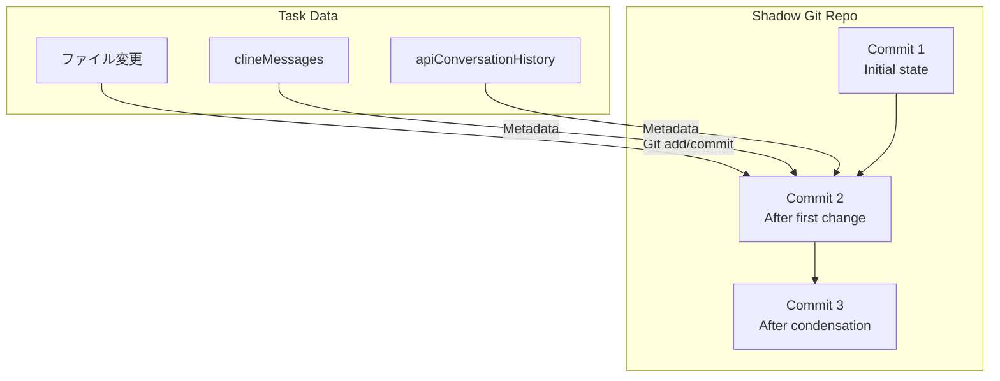

# Roo Code コンテキスト管理システム - 高度なトピック

## 目次
1. [チェックポイントとの統合](#チェックポイントとの統合)
2. [UIコンポーネント](#uiコンポーネント)
3. [プロファイル別設定](#プロファイル別設定)
4. [テレメトリとモニタリング](#テレメトリとモニタリング)
5. [パフォーマンス最適化](#パフォーマンス最適化)
6. [エラーハンドリングとリトライ](#エラーハンドリングとリトライ)
7. [トラブルシューティング](#トラブルシューティング)

---

## チェックポイントとの統合

Roo Codeのコンテキスト管理は、チェックポイント（スナップショット）機能と深く統合されています。

### Shadow Gitリポジトリ

**モジュール**: [`src/services/checkpoints/`](../../src/services/checkpoints/)

各タスクには専用のShadow Gitリポジトリがあり、ファイル変更と会話履歴を同期してバージョン管理します。



### チェックポイント保存時の処理

**ファイル**: [`src/core/task/Task.ts`](../../src/core/task/Task.ts) (関連部分)

```typescript
// チェックポイント保存
async saveCheckpoint(message: string) {
  const checkpointService = await getCheckpointService(this)

  await checkpointSave({
    service: checkpointService,
    message: message,
    // 現在の会話状態を含める
    metadata: {
      clineMessages: this.clineMessages,
      apiConversationHistory: this.apiConversationHistory,
      tokenUsage: this.getTokenUsage()
    }
  })
}
```

### チェックポイント復元時の処理

```typescript
// チェックポイント復元
async restoreCheckpoint(checkpointId: string) {
  const checkpointService = await getCheckpointService(this)

  const restored = await checkpointRestore({
    service: checkpointService,
    checkpointId: checkpointId
  })

  // 会話履歴の巻き戻し
  const targetTs = restored.metadata.timestamp

  await this.messageManager.rewindToTimestamp(targetTs, {
    includeTargetMessage: false
  })

  // ファイルも復元される（Shadow Gitのcheckout）
}
```

### コンテキストイベントとチェックポイント

**重要な動作**:

1. **凝縮/トランケーション実行時**:
   - コンテキスト管理イベント（`condense_context`、`sliding_window_truncation`）がclineMessagesに追加される
   - 自動的にチェックポイントが作成される（設定により）

2. **チェックポイント復元時**:
   - MessageManagerが自動的に孤立したサマリー/マーカーを削除
   - 会話状態が一貫性を保つ

**コード例**:

```typescript
// Task.ts内
async afterCondensation(condenseId: string, summary: string, cost: number, tokens: number) {
  // UIイベント送信
  this.addClineMessage({
    type: "say",
    say: "condense_context",
    ts: Date.now(),
    contextCondense: {
      condenseId,
      summary,
      cost,
      prevContextTokens: this.prevContextTokens,
      newContextTokens: tokens
    }
  })

  // 自動チェックポイント保存（設定により）
  if (this.enableCheckpoints && this.autoCheckpointOnCondense) {
    await this.saveCheckpoint(`Context condensed: ${tokens} tokens`)
  }
}
```

### チェックポイント差分表示

```typescript
// チェックポイント間の差分を表示
async showCheckpointDiff(fromId: string, toId: string) {
  const checkpointService = await getCheckpointService(this)

  const diff = await checkpointDiff({
    service: checkpointService,
    from: fromId,
    to: toId,
    options: {
      includeConversation: true  // 会話の差分も含める
    }
  })

  // 差分にはファイル変更と会話変更の両方が含まれる
  console.log("File changes:", diff.files)
  console.log("Messages added:", diff.messagesAdded)
  console.log("Messages removed:", diff.messagesRemoved)
  console.log("Condense events:", diff.condenseEvents)
}
```

---

## UIコンポーネント

### コンテキストウィンドウプログレス

**ファイル**: [`webview-ui/src/components/chat/ContextWindowProgress.tsx`](../../webview-ui/src/components/chat/ContextWindowProgress.tsx)

**目的**: トークン使用状況を視覚化

```tsx
<ContextWindowProgress
  contextTokens={140000}
  contextWindow={200000}
  maxTokens={4096}
/>
```

**表示内容**:
- **使用中** (青): `contextTokens` (70%)
- **予約済み** (黄): `maxTokens + バッファ` (12%)
- **利用可能** (灰): 残り (18%)

**実装**:
```tsx
const calculateTokenDistribution = (
  contextTokens: number,
  contextWindow: number,
  maxTokens: number
) => {
  const reservedTokens = maxTokens + (contextWindow * TOKEN_BUFFER_PERCENTAGE)
  const usedPercent = (contextTokens / contextWindow) * 100
  const reservedPercent = (reservedTokens / contextWindow) * 100
  const availablePercent = 100 - usedPercent - reservedPercent

  return { usedPercent, reservedPercent, availablePercent }
}
```

### 凝縮結果表示

**ファイル**: [`webview-ui/src/components/chat/context-management/CondensationResultRow.tsx`](../../webview-ui/src/components/chat/context-management/CondensationResultRow.tsx)

**表示内容**:
- トークン削減数と削減率
- LLM APIコスト
- サマリーテキスト（展開/折りたたみ可能）

```tsx
<CondensationResultRow
  cost={0.05}
  prevContextTokens={150000}
  newContextTokens={45000}
  summary="Previous Conversation: User requested implementation of..."
  condenseId="uuid-123"
/>
```

**UI例**:
```
┌────────────────────────────────────────────────┐
│ 🔄 Context Condensed                           │
│                                                │
│ Tokens: 150,000 → 45,000 (70% reduction)      │
│ Cost: $0.05                                    │
│                                                │
│ ▼ View Summary                                 │
│   Previous Conversation: ...                   │
│   Current Work: ...                            │
│   Key Technical Concepts: ...                  │
└────────────────────────────────────────────────┘
```

### トランケーション結果表示

**ファイル**: [`webview-ui/src/components/chat/context-management/TruncationResultRow.tsx`](../../webview-ui/src/components/chat/context-management/TruncationResultRow.tsx)

```tsx
<TruncationResultRow
  messagesRemoved={10}
  prevContextTokens={180000}
  newContextTokens={90000}
  truncationId="uuid-456"
/>
```

**UI例**:
```
┌────────────────────────────────────────────────┐
│ ✂️ Sliding Window Truncation                   │
│                                                │
│ 10 messages hidden to reduce context          │
│ Tokens: 180,000 → 90,000                      │
└────────────────────────────────────────────────┘
```

### 進行中インジケータ

**ファイル**: [`webview-ui/src/components/chat/context-management/InProgressRow.tsx`](../../webview-ui/src/components/chat/context-management/InProgressRow.tsx)

```tsx
<InProgressRow type="condense_context" />
```

**UI例**:
```
┌────────────────────────────────────────────────┐
│ ⏳ Condensing context...                       │
└────────────────────────────────────────────────┘
```

### 設定UI

**ファイル**: [`webview-ui/src/components/settings/ContextManagementSettings.tsx`](../../webview-ui/src/components/settings/ContextManagementSettings.tsx)

**設定項目**:

1. **自動凝縮の有効/無効**:
   ```tsx
   <VSCodeCheckbox
     checked={autoCondenseContext}
     onChange={(e) => setCachedStateField("autoCondenseContext", e.target.checked)}
   >
     Enable automatic context condensation
   </VSCodeCheckbox>
   ```

2. **凝縮しきい値スライダー**:
   ```tsx
   <Slider
     min={10}
     max={100}
     step={5}
     value={[autoCondenseContextPercent]}
     onValueChange={([value]) => setCachedStateField("autoCondenseContextPercent", value)}
   />
   <span>{autoCondenseContextPercent}%</span>
   ```

3. **プロファイル別しきい値**:
   ```tsx
   <Select
     value={selectedProfile}
     onValueChange={setSelectedProfile}
   >
     <SelectItem value="default">Global Default</SelectItem>
     <SelectItem value="claude-opus-4">Claude Opus 4</SelectItem>
     <SelectItem value="gpt-4-turbo">GPT-4 Turbo</SelectItem>
   </Select>

   <Slider
     value={[getCurrentThresholdValue()]}
     onValueChange={([value]) => handleThresholdChange(value)}
   />
   ```

4. **その他の設定**:
   - 最大開いているタブ数
   - 最大ワークスペースファイル数
   - 最大ファイル読み取り行数
   - 最大画像サイズ

---

## プロファイル別設定

### 設定の階層構造

```
Global Settings (autoCondenseContextPercent: 75)
└── Profile Settings (profileThresholds)
    ├── "claude-opus-4": 80
    ├── "claude-haiku": 60
    ├── "gpt-4-turbo": 70
    └── "custom-profile": -1  ← グローバル設定を継承
```

### 設定の優先順位

```typescript
// manageContext() 内
let effectiveThreshold = autoCondenseContextPercent  // グローバル設定

const profileThreshold = profileThresholds[currentProfileId]
if (profileThreshold !== undefined) {
  if (profileThreshold === -1) {
    // 継承: グローバル設定を使用
    effectiveThreshold = autoCondenseContextPercent
  } else if (
    profileThreshold >= MIN_CONDENSE_THRESHOLD &&
    profileThreshold <= MAX_CONDENSE_THRESHOLD
  ) {
    // カスタム設定
    effectiveThreshold = profileThreshold
  } else {
    // 無効な値: グローバル設定にフォールバック
    console.warn(`Invalid threshold: ${profileThreshold}`)
    effectiveThreshold = autoCondenseContextPercent
  }
}
```

### 推奨プロファイル設定

| モデル | コンテキストウィンドウ | 推奨しきい値 | 理由 |
|--------|----------------------|------------|------|
| Claude Opus 4 | 200k | 80% | 高性能、高コスト→最大限活用 |
| Claude Sonnet | 200k | 75% | バランス型 |
| Claude Haiku | 200k | 60% | 低コスト→早めに凝縮 |
| GPT-4 Turbo | 128k | 70% | 小さめのウィンドウ |
| GPT-3.5 | 16k | 50% | 非常に小さいウィンドウ |

### プロファイル設定の永続化

**ファイル**: VSCode設定 (`settings.json`)

```json
{
  "rooCode.autoCondenseContext": true,
  "rooCode.autoCondenseContextPercent": 75,
  "rooCode.profileThresholds": {
    "claude-opus-4-5-20251101": 80,
    "claude-3-5-haiku-20241022": 60,
    "gpt-4-turbo": 70
  }
}
```

---

## テレメトリとモニタリング

### テレメトリイベント

**モジュール**: [`@roo-code/telemetry`](../../packages/telemetry/)

#### コンテキスト凝縮イベント

```typescript
TelemetryService.instance.captureContextCondensed(
  taskId: string,
  isAutomaticTrigger: boolean,
  hasCustomPrompt: boolean,
  hasCustomHandler: boolean
)
```

**送信されるデータ**:
- タスクID
- トリガータイプ（自動/手動）
- カスタムプロンプト使用有無
- カスタムハンドラー使用有無

#### スライディングウィンドウトランケーションイベント

```typescript
TelemetryService.instance.captureSlidingWindowTruncation(taskId: string)
```

### モニタリング指標

#### 1. トークン使用率

```typescript
interface TokenUsage {
  totalTokensIn: number      // 入力トークン総数
  totalTokensOut: number     // 出力トークン総数
  totalCacheWrites: number   // キャッシュ書き込み
  totalCacheReads: number    // キャッシュ読み込み
  totalCost: number          // 総コスト（USD）
  contextTokens: number      // 現在のコンテキストトークン数
}

// リアルタイム更新
task.on(RooCodeEventName.TaskTokenUsageUpdated, (usage: TokenUsage) => {
  const utilizationPercent = (usage.contextTokens / contextWindow) * 100
  console.log(`Context utilization: ${utilizationPercent.toFixed(1)}%`)
})
```

#### 2. 凝縮効率

```typescript
// 凝縮前後のトークン数を追跡
const condensationEfficiency = {
  before: prevContextTokens,
  after: newContextTokens,
  reduction: prevContextTokens - newContextTokens,
  reductionPercent: ((prevContextTokens - newContextTokens) / prevContextTokens) * 100,
  cost: cost
}

console.log(`Condensation efficiency: ${condensationEfficiency.reductionPercent.toFixed(1)}%`)
console.log(`Cost per 1k tokens saved: $${(cost / (condensationEfficiency.reduction / 1000)).toFixed(4)}`)
```

#### 3. コンテキスト管理頻度

```typescript
// タスク全体での統計
interface ContextManagementStats {
  condensationCount: number       // 凝縮実行回数
  truncationCount: number         // トランケーション実行回数
  totalTokensSaved: number        // 節約されたトークン総数
  totalCost: number               // 凝縮の総コスト
  averageReduction: number        // 平均削減率
}
```

---

## パフォーマンス最適化

### 1. トークンカウントのキャッシング

**問題**: 同じメッセージのトークン数を何度も計算するのは無駄

**解決策**: メモ化

```typescript
class TokenCountCache {
  private cache = new Map<string, number>()

  async count(
    content: Anthropic.Messages.ContentBlockParam[],
    apiHandler: ApiHandler
  ): Promise<number> {
    const key = JSON.stringify(content)

    if (this.cache.has(key)) {
      return this.cache.get(key)!
    }

    const count = await apiHandler.countTokens(content)
    this.cache.set(key, count)

    // キャッシュサイズ制限
    if (this.cache.size > 1000) {
      const firstKey = this.cache.keys().next().value
      this.cache.delete(firstKey)
    }

    return count
  }

  clear() {
    this.cache.clear()
  }
}

// 使用例
const tokenCache = new TokenCountCache()
const tokens = await tokenCache.count(messageContent, apiHandler)
```

### 2. デバウンス処理

**問題**: トークン使用状況をリアルタイム更新すると、UIが頻繁に再レンダリングされる

**解決策**: デバウンス

**ファイル**: [`src/core/task/Task.ts`](../../src/core/task/Task.ts)

```typescript
// 500ms ごとに最大1回更新
private debouncedEmitTokenUsage = debounce(
  () => {
    this.emit(RooCodeEventName.TaskTokenUsageUpdated, this.getTokenUsage())
  },
  500,
  { maxWait: 1000 }
)
```

### 3. 並列処理

**問題**: 凝縮中は他の処理がブロックされる

**解決策**: 非同期処理とプログレスインジケータ

```typescript
// UI側
async sendMessage(text: string) {
  // 事前チェック
  if (willManageContext(options)) {
    showInProgressIndicator("condense_context")
  }

  // 非同期実行（UIはブロックしない）
  const result = await manageContext(options)

  hideInProgressIndicator()

  // 結果を表示
  if (result.condenseId) {
    showCondensationResult(result)
  }
}
```

### 4. ストリーミングレスポンスの最適化

**問題**: ストリーミング中にトークンカウントを頻繁に更新すると遅い

**解決策**: バッチ更新

```typescript
// ストリーミング中
for await (const chunk of stream) {
  if (chunk.type === "text") {
    accumulatedText += chunk.text
  } else if (chunk.type === "usage") {
    // 最終的な使用状況のみ記録
    finalUsage = chunk
  }
}

// ストリーム終了後にまとめて更新
await updateContextTokens(finalUsage)
```

---

## エラーハンドリングとリトライ

### コンテキストウィンドウ超過エラー

**ファイル**: [`src/core/task/Task.ts`](../../src/core/task/Task.ts) (関連部分)

```typescript
const MAX_CONTEXT_WINDOW_RETRIES = 3
const FORCED_CONTEXT_REDUCTION_PERCENT = 75

async sendMessageWithRetry(messages: ApiMessage[]) {
  let retryCount = 0

  while (retryCount < MAX_CONTEXT_WINDOW_RETRIES) {
    try {
      return await this.api.createMessage(this.systemPrompt, messages)
    } catch (error) {
      if (checkContextWindowExceededError(error, this.apiProvider)) {
        retryCount++

        console.warn(
          `Context window exceeded (attempt ${retryCount}/${MAX_CONTEXT_WINDOW_RETRIES}). ` +
          `Forcing context reduction...`
        )

        // 強制的にトランケーション（75%を保持）
        const truncationResult = truncateConversation(
          messages,
          1 - FORCED_CONTEXT_REDUCTION_PERCENT / 100,
          this.taskId
        )

        messages = truncationResult.messages

        // UIに通知
        this.sendTruncationEvent({
          truncationId: truncationResult.truncationId,
          messagesRemoved: truncationResult.messagesRemoved,
          prevContextTokens: this.getContextTokens(),
          newContextTokens: await this.calculateNewContextTokens(messages)
        })
      } else {
        throw error  // 他のエラーは再スロー
      }
    }
  }

  throw new Error(`Failed after ${MAX_CONTEXT_WINDOW_RETRIES} context reduction attempts`)
}
```

### エラーパターン検出

**ファイル**: [`src/core/context/context-management/context-error-handling.ts`](../../src/core/context/context-management/context-error-handling.ts)

```typescript
export function checkContextWindowExceededError(
  error: any,
  apiProvider?: string
): boolean {
  const errorMessage = error?.message?.toLowerCase() || ""

  // Anthropic
  if (apiProvider === "anthropic" || error?.status === 400) {
    return errorMessage.includes("prompt is too long") ||
           errorMessage.includes("maximum context length")
  }

  // OpenAI
  if (apiProvider === "openai" || error?.code === "context_length_exceeded") {
    return errorMessage.includes("maximum context length") ||
           errorMessage.includes("reduce the length")
  }

  // OpenRouter
  if (apiProvider === "openrouter") {
    return errorMessage.includes("context length") ||
           errorMessage.includes("max context")
  }

  // Cerebras (またはその他)
  return errorMessage.includes("context") && errorMessage.includes("length")
}
```

### 凝縮失敗時のフォールバック

```typescript
const result = await manageContext(options)

if (result.error) {
  // 凝縮失敗（すでにトランケーションにフォールバック済み）
  console.warn(`Condensation failed: ${result.error}`)

  if (result.truncationId) {
    // トランケーション成功
    console.log(`Fallback to truncation: ${result.messagesRemoved} messages removed`)
  } else {
    // トランケーションも不要だった
    console.log("No context management needed")
  }
}
```

### APIハンドラー検証

```typescript
// condensingApiHandler の検証
if (!handlerToUse || typeof handlerToUse.createMessage !== "function") {
  console.warn(
    "Chosen API handler for condensing does not support message creation or is invalid, " +
    "falling back to main apiHandler."
  )
  handlerToUse = apiHandler

  if (!handlerToUse || typeof handlerToUse.createMessage !== "function") {
    const error = t("common:errors.condense_handler_invalid")
    return { ...response, error }
  }
}
```

---

## トラブルシューティング

### よくある問題と解決策

#### 1. 凝縮後にコンテキストが増大する

**症状**:
```
Error: common:errors.condense_context_grew
```

**原因**:
- サマリーが元のメッセージより長い
- LLMが過度に詳細なサマリーを生成

**解決策**:

1. カスタムプロンプトで長さ制限を明示:
   ```typescript
   const customPrompt = `
   Summarize the conversation in under 500 words.
   Focus only on the most critical information.
   `
   ```

2. より小さいモデルを使用（Haikuなど）:
   ```typescript
   const condensingApiHandler = buildApiHandler({
     apiModelId: "claude-3-5-haiku-20241022"
   })
   ```

#### 2. tool_resultエラー

**症状**:
```
Error: tool_result blocks require matching tool_use blocks
```

**原因**:
- Native Toolsプロトコル使用時、`tool_use`と`tool_result`のペアが崩れている

**解決策**:
- `useNativeTools: true` を設定:
  ```typescript
  const result = await manageContext({
    ...options,
    useNativeTools: true  // ← 必須
  })
  ```

#### 3. DeepSeekの`reasoning_content`エラー

**症状**:
```
400 Missing reasoning_content field in the assistant message
```

**原因**:
- DeepSeek/Z.aiはすべてのassistantメッセージに`reasoning_content`が必要

**解決策**:
- 自動的に処理されます（`syntheticReasoningBlock`が追加される）
- カスタム実装の場合は、reasoningブロックを確実に含める:
  ```typescript
  const summaryContent = [
    { type: "reasoning", text: "Summary reasoning..." },  // 必須
    { type: "text", text: summary }
  ]
  ```

#### 4. 巻き戻し後にメッセージが復元されない

**症状**:
- チェックポイント復元後、古いメッセージが表示されない

**原因**:
- `cleanupAfterTruncation()`が呼ばれていない

**解決策**:
- 常に`MessageManager`を使用:
  ```typescript
  // ✅ 正しい
  await task.messageManager.rewindToTimestamp(ts)

  // ❌ 間違い（直接削除しない）
  task.apiConversationHistory = task.apiConversationHistory.filter(...)
  ```

#### 5. トークンカウントが不正確

**症状**:
- コンテキストウィンドウ超過エラーが予期せず発生

**原因**:
- Tiktokenの推定精度の問題
- 誤差調整係数が不足

**解決策**:
- `TOKEN_FUDGE_FACTOR`を調整:
  ```typescript
  // src/utils/tiktoken.ts
  const TOKEN_FUDGE_FACTOR = 2.0  // より保守的に
  ```

- または、より低いしきい値を設定:
  ```typescript
  autoCondenseContextPercent: 65  // 75% から 65% に
  ```

#### 6. 凝縮が頻繁に失敗する

**症状**:
```
Error: common:errors.condense_failed
```

**原因**:
- LLM APIの不安定性
- ネットワークエラー
- レート制限

**解決策**:

1. 専用ハンドラーを使用（より安定したプロバイダー）:
   ```typescript
   const condensingApiHandler = buildApiHandler({
     apiProvider: "anthropic",  // より安定したプロバイダー
     apiModelId: "claude-3-5-haiku-20241022"
   })
   ```

2. タイムアウトを増やす:
   ```typescript
   const condensingApiHandler = buildApiHandler({
     ...config,
     timeout: 60000  // 60秒
   })
   ```

3. リトライロジックを追加:
   ```typescript
   async function summarizeWithRetry(options, maxRetries = 3) {
     for (let i = 0; i < maxRetries; i++) {
       const result = await summarizeConversation(options)
       if (!result.error) {
         return result
       }
       await delay(1000 * (i + 1))  // 指数バックオフ
     }
     throw new Error("Condensation failed after retries")
   }
   ```

---

## デバッグ技法

### 1. コンソールログの有効化

```typescript
// MessageManager内
console.log(`[MessageManager] Found condense_context to remove: ${condenseId}`)
console.log(`[MessageManager] Removing orphaned Summary with condenseId: ${condenseId}`)
```

**フィルタリング**:
```bash
# VSCode Developer Console で
[MessageManager]
```

### 2. メッセージ構造の検査

```typescript
function debugMessages(messages: ApiMessage[]) {
  console.log("=== Message Structure ===")

  messages.forEach((msg, i) => {
    const tags = []
    if (msg.isSummary) tags.push("SUMMARY")
    if (msg.isTruncationMarker) tags.push("MARKER")
    if (msg.condenseParent) tags.push(`condenseParent=${msg.condenseParent}`)
    if (msg.truncationParent) tags.push(`truncationParent=${msg.truncationParent}`)

    console.log(`[${i}] ${msg.role} | ${tags.join(", ")} | ts=${msg.ts}`)
  })

  console.log("\n=== Effective History ===")
  const effective = getEffectiveApiHistory(messages)
  console.log(`Original: ${messages.length}, Effective: ${effective.length}`)
}
```

### 3. トークン追跡

```typescript
function debugTokens(task: Task) {
  const usage = task.getTokenUsage()

  console.log("=== Token Usage ===")
  console.log(`Context: ${usage.contextTokens}`)
  console.log(`Context Window: ${task.getContextWindow()}`)
  console.log(`Utilization: ${(usage.contextTokens / task.getContextWindow() * 100).toFixed(1)}%`)
  console.log(`Total In: ${usage.totalTokensIn}`)
  console.log(`Total Out: ${usage.totalTokensOut}`)
  console.log(`Total Cost: $${usage.totalCost.toFixed(4)}`)
}
```

### 4. イベントトレース

```typescript
task.on(RooCodeEventName.TaskTokenUsageUpdated, (usage) => {
  console.log(`[Event] Token usage updated: ${usage.contextTokens}`)
})

task.on(RooCodeEventName.CondenseTaskContextStarted, () => {
  console.log("[Event] Condensation started")
})

task.on(RooCodeEventName.CondenseTaskContextCompleted, (result) => {
  console.log(`[Event] Condensation completed: ${result.summary.substring(0, 50)}...`)
})
```

---

## まとめ

このドキュメントでは、Roo Codeのコンテキスト管理システムの高度なトピックを解説しました：

1. **チェックポイント統合**: Shadow Gitリポジトリとの同期
2. **UIコンポーネント**: 進行状況と結果の可視化
3. **プロファイル別設定**: モデルごとの最適化
4. **テレメトリ**: 使用状況のモニタリング
5. **パフォーマンス最適化**: キャッシング、デバウンス
6. **エラーハンドリング**: リトライとフォールバック
7. **トラブルシューティング**: よくある問題と解決策

これらの知識を組み合わせることで、Roo Codeのコンテキスト管理システムを完全に理解し、同様のシステムを実装することができます。

## 関連ドキュメント

- [**01-overview.md**](./01-overview.md) - 概要とアーキテクチャ
- [**02-implementation.md**](./02-implementation.md) - 実装の詳細
- [**03-api-reference.md**](./03-api-reference.md) - APIリファレンス

## 参考リソース

### ソースコード
- [チェックポイントサービス](../../src/services/checkpoints/)
- [UIコンポーネント](../../webview-ui/src/components/chat/context-management/)
- [設定UI](../../webview-ui/src/components/settings/ContextManagementSettings.tsx)
- [エラーハンドリング](../../src/core/context/context-management/context-error-handling.ts)

### テストファイル
- [コンテキスト管理テスト](../../src/core/context-management/__tests__/)
- [凝縮テスト](../../src/core/condense/__tests__/)
- [メッセージマネージャーテスト](../../src/core/message-manager/index.spec.ts)
