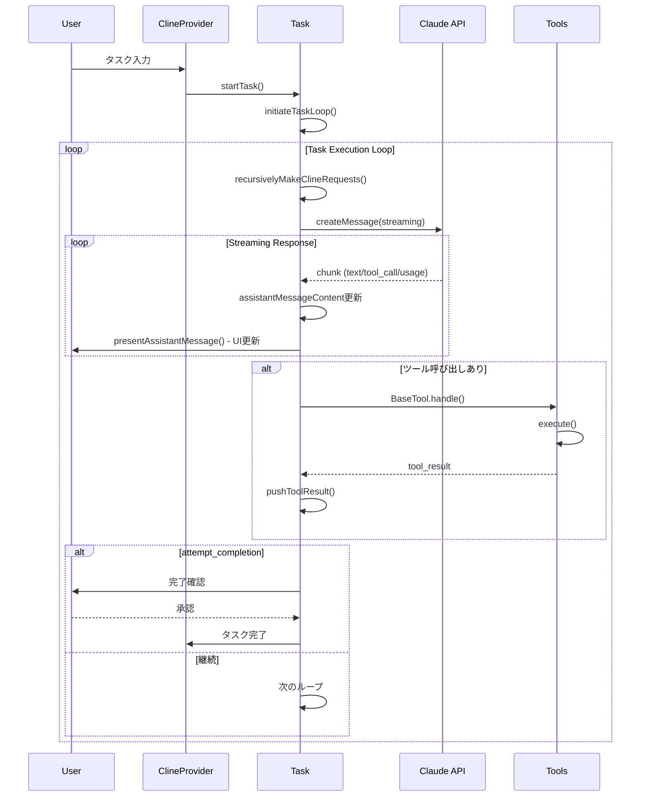
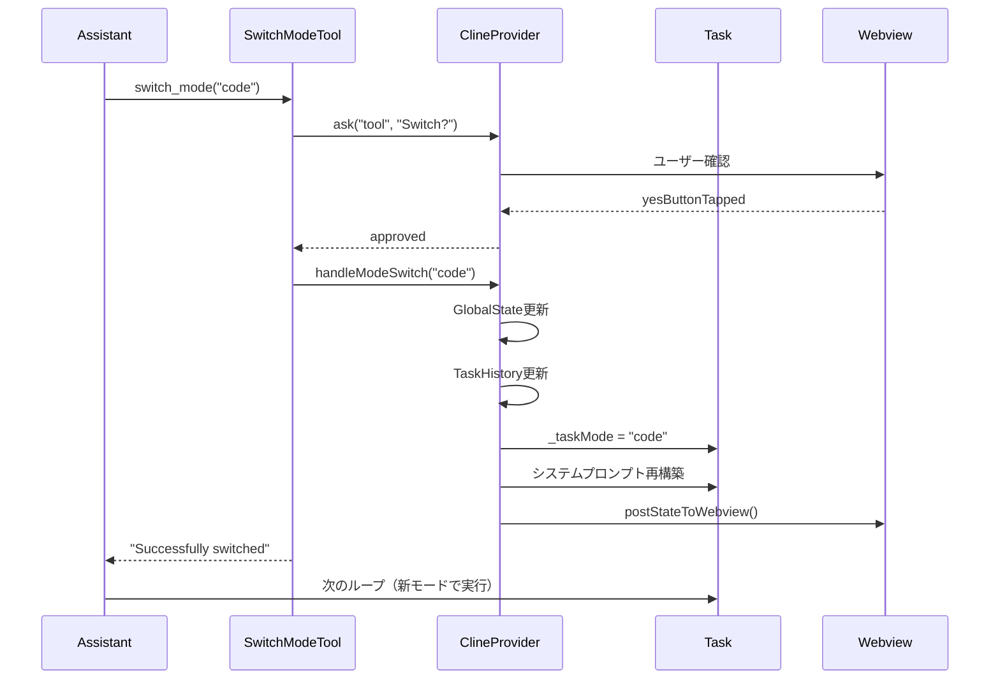
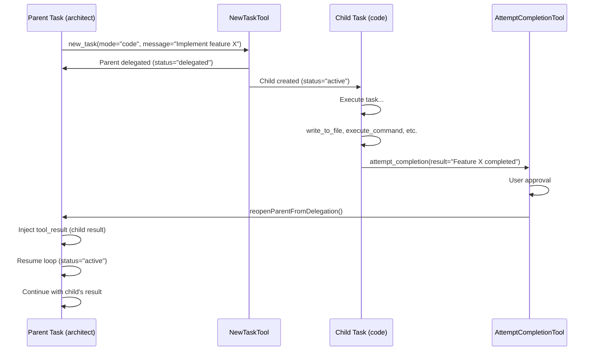
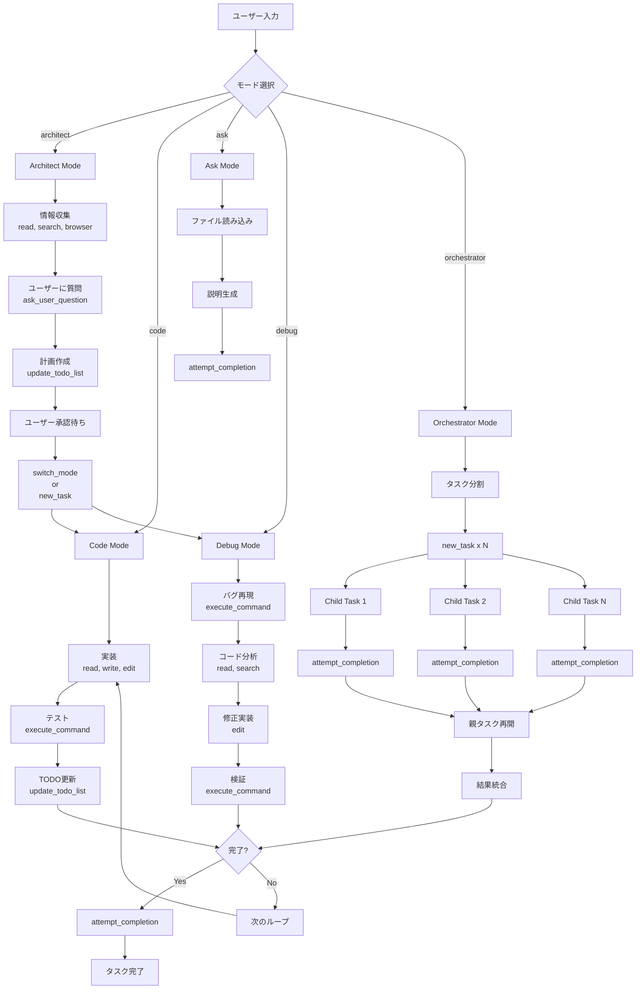

# Roo Codeのタスク実行フローとモード管理

## 概要

このドキュメントでは、Roo Codeがユーザーのタスクをどのように処理し、実行するかの全体フローを解説します。

Context Managementはタスク実行の一部として機能するため、全体像を理解することで、より効果的にRoo Codeを活用できます。

---

## 🔄 タスク実行の全体フロー

### アーキテクチャ図



### 実行フローの詳細

#### 1. タスク開始

**エントリーポイント**: `src/core/task/Task.ts`

```typescript
// タスクの開始
static async startTask(
  taskId: string,
  provider: ClineProvider,
  mode: ModeConfig
): Promise<Task>

// または履歴からの再開
static async resumeTaskFromHistory(
  historyItem: HistoryItem,
  provider: ClineProvider
): Promise<Task>
```

**処理の流れ**:

1. **Task インスタンス作成**
   - `taskId` (UUID)
   - `mode` 設定
   - `apiConversationHistory` 初期化
   - `clineMessages` 初期化

2. **initiateTaskLoop() 呼び出し**
   ```typescript
   private async initiateTaskLoop(): Promise<void> {
     while (!this.abort) {
       await this.recursivelyMakeClineRequests()

       if (!this.didToolUse) {
         // ツール使用なし → タスク完了を促す
         await this.say("text", "...")
         break
       }
     }
   }
   ```

#### 2. LLMとの対話ループ

**`recursivelyMakeClineRequests()`** - コア実行エンジン

```typescript
private async recursivelyMakeClineRequests(): Promise<void> {
  // 1. ユーザーメッセージの構築
  const userContent = this.userMessageContent.map(block => {
    // text, image, tool_result ブロックを処理
  })

  // 2. 環境詳細の追加（初回のみ）
  if (this.apiConversationHistory.length === 0) {
    userContent.unshift({
      type: "text",
      text: await this.getEnvironmentDetails()
    })
  }

  // 3. Context Management実行
  const result = await manageContext({
    messages: this.apiConversationHistory,
    totalTokens: this.currentContextTokens,
    contextWindow: this.api.info.contextWindow,
    // ... 設定
  })

  // 4. API呼び出し
  const stream = this.api.createMessage({
    systemPrompt: this.buildSystemPrompt(),
    messages: result.managedMessages,
    tools: this.getAvailableTools()
  })

  // 5. ストリーミング処理
  for await (const chunk of stream) {
    await this.handleStreamChunk(chunk)
  }
}
```

#### 3. ストリーミング処理

**チャンク型による分岐処理**:

```typescript
async handleStreamChunk(chunk: StreamChunk): Promise<void> {
  switch (chunk.type) {
    case "text":
      // テキストブロック追加
      this.assistantMessageContent.push({
        type: "text",
        text: chunk.text
      })
      await this.presentAssistantMessage()
      break

    case "tool_call":
      // ツール呼び出し検出
      this.didToolUse = true
      await this.handleToolCall(chunk.toolCall)
      break

    case "tool_call_partial":
      // 部分的なツール呼び出し（NTCプロトコル）
      this.nativeToolCallParser.update(chunk)
      await this.presentAssistantMessage()
      break

    case "usage":
      // トークン統計更新
      this.currentApiUsage = chunk.usage
      break

    case "reasoning":
      // 思考過程表示（extended thinking）
      this.currentReasoning = chunk.text
      await this.presentAssistantMessage()
      break
  }
}
```

#### 4. ツール実行

**`handleToolCall()`** - ツール呼び出し処理

```typescript
async handleToolCall(toolCall: ToolCall): Promise<void> {
  // 1. BaseTool.handle()でツール実行
  const tool = this.getToolByName(toolCall.name)

  const result = await tool.handle({
    toolUse: toolCall,
    ask: this.ask.bind(this),
    say: this.say.bind(this),
    // ... コンテキスト
  })

  // 2. 結果をuserMessageContentに追加
  this.pushToolResult({
    type: "tool_result",
    tool_use_id: toolCall.id,
    content: result.content,
    is_error: result.isError
  })

  // 3. UI更新
  await this.presentAssistantMessage()
}
```

**ツールの種類**:

| カテゴリ | ツール | 役割 |
|---------|-------|------|
| **ファイル操作** | read_file, write_to_file, edit_file | ファイルの読み書き |
| **検索** | search_files, grep_search | コード検索 |
| **コマンド** | execute_command | シェルコマンド実行 |
| **ブラウザ** | browser_action | Web操作 |
| **MCP** | use_mcp_tool | 外部ツール統合 |
| **制御** | attempt_completion, new_task, switch_mode | タスク制御 |
| **管理** | update_todo_list, ask_user_question | タスク管理 |

---

## 🎯 モード管理システム

### モードとは

Roo Codeは**モード**という概念で、異なるタスクタイプに応じた動作を定義します。

各モードは以下を規定します：

- **役割定義** (roleDefinition): LLMに与えるロール
- **カスタム指示** (customInstructions): モード固有の指示
- **利用可能なツール** (groups): アクセス可能なツールセット
- **動作スタイル**: 計画重視 vs 実行重視など

### デフォルトモード（5種類）

**定義場所**: `packages/types/src/mode.ts`

#### 1. 🏗️ Architect（計画・設計）

```typescript
{
  slug: "architect",
  name: "🏗️ Architect",
  roleDefinition: "You are Roo, an experienced technical leader who is inquisitive and an excellent planner.",
  description: "Plan and design before implementation",

  groups: [
    "read",                         // ファイル読み込み
    ["edit", { fileRegex: "\\.md$" }], // .mdファイルのみ編集
    "browser",                      // Web検索
    "mcp"                          // 外部ツール
  ],

  customInstructions: `
1. Do information gathering using read, search, and browser tools
2. Ask questions to clarify requirements
3. Create a detailed plan using update_todo_list tool
4. Present plan to user for approval
5. Use switch_mode to 'code' or new_task to begin implementation
  `
}
```

**用途**:
- 複雑な機能の計画
- アーキテクチャ設計
- 要件の明確化

**フロー**:
```
情報収集 → ユーザー質問 → 計画作成 → 承認 → switch_mode("code")
```

#### 2. 💻 Code（実装）

```typescript
{
  slug: "code",
  name: "💻 Code",
  roleDefinition: "You are Roo, an expert software engineer.",
  description: "Write and modify code",

  groups: [
    "read",
    "edit",      // すべてのファイル編集可能
    "command",   // コマンド実行
    "browser",
    "mcp"
  ],

  customInstructions: `
1. Read relevant files before making changes
2. Make focused, incremental changes
3. Test your changes with execute_command
4. Use update_todo_list to track progress
  `
}
```

**用途**:
- コードの実装
- バグ修正
- リファクタリング

#### 3. ❓ Ask（質問・説明）

```typescript
{
  slug: "ask",
  name: "❓ Ask",
  roleDefinition: "You are Roo, a knowledgeable assistant.",
  description: "Answer questions and explain code",

  groups: [
    "read",      // 読み込みのみ
    "browser",
    "mcp"
  ],

  customInstructions: `
1. Read relevant files to understand context
2. Provide clear, detailed explanations
3. Use examples and diagrams when helpful
4. Do NOT modify any files
  `
}
```

**用途**:
- コードの説明
- 質問への回答
- ドキュメントの理解

#### 4. 🐛 Debug（デバッグ）

```typescript
{
  slug: "debug",
  name: "🐛 Debug",
  roleDefinition: "You are Roo, an expert debugger.",
  description: "Investigate and fix bugs",

  groups: [
    "read",
    "edit",
    "command",   // テスト実行に重要
    "browser",
    "mcp"
  ],

  customInstructions: `
1. Reproduce the bug with execute_command
2. Read relevant code to understand the issue
3. Form hypotheses and test them
4. Fix the bug with minimal changes
5. Verify the fix with tests
  `
}
```

**用途**:
- バグ調査
- エラーの原因特定
- 修正の実装と検証

#### 5. 🎭 Orchestrator（オーケストレーション）

```typescript
{
  slug: "orchestrator",
  name: "🎭 Orchestrator",
  roleDefinition: "You are Roo, a strategic coordinator who breaks down complex tasks.",
  description: "Coordinate multiple subtasks",

  groups: [
    "read",
    ["edit", { fileRegex: "\\.md$" }],
    "browser",
    "mcp"
  ],

  customInstructions: `
1. Analyze the overall goal
2. Break it into independent subtasks
3. Use new_task to delegate each subtask with appropriate mode
4. Track overall progress
5. Synthesize results from subtasks
  `
}
```

**用途**:
- 大規模タスクの分割
- 複数サブタスクの調整
- 結果の統合

---

## 🔀 モード切り替えのフロー

### 1. switch_mode ツールによる切り替え

**定義**: `src/core/tools/SwitchModeTool.ts`

```typescript
class SwitchModeTool extends BaseTool {
  async execute(params: {
    mode: string  // 切り替え先のモードslug
  }): Promise<ToolResult> {
    // 1. モードの検証
    const targetMode = findModeBySlug(params.mode)
    if (!targetMode) {
      return {
        content: `Error: Mode '${params.mode}' not found`,
        isError: true
      }
    }

    // 2. ユーザー承認確認
    const { response } = await this.ask("tool", `Switch to ${targetMode.name} mode?`)

    if (response !== "yesButtonTapped") {
      return { content: "Mode switch cancelled" }
    }

    // 3. ClineProvider.handleModeSwitch() 呼び出し
    await this.clineProvider.handleModeSwitch(targetMode.slug)

    return {
      content: `Successfully switched to ${targetMode.name} mode`
    }
  }
}
```

**ClineProvider.handleModeSwitch()** の処理:

```typescript
async handleModeSwitch(newModeSlug: string): Promise<void> {
  // 1. 新しいモード設定を取得
  const newMode = findModeBySlug(newModeSlug)

  // 2. グローバルStateを更新
  await this.updateGlobalState({
    currentMode: newModeSlug
  })

  // 3. タスク履歴を更新
  await this.updateTaskHistory(this.currentTask.id, {
    mode: newModeSlug
  })

  // 4. Task._taskMode を更新
  this.currentTask._taskMode = newModeSlug

  // 5. APIプロファイル切り替え（モード毎の設定）
  if (this.hasModeSpecificApiConfig(newModeSlug)) {
    this.currentTask.api = this.getApiForMode(newModeSlug)
  }

  // 6. Webviewに通知
  this.postStateToWebview()

  // 7. システムプロンプト再構築（次のループで使用）
  // 新しいモードのroleDefinition + customInstructionsが適用される
}
```

**フロー図**:



### 2. new_task ツールによるサブタスク委譲

**定義**: `src/core/tools/NewTaskTool.ts`

より高度な機能で、**新しいモードで別タスクを起動**します。

```typescript
class NewTaskTool extends BaseTool {
  async execute(params: {
    mode: string        // サブタスクのモード
    message: string     // サブタスクへの指示
    todos?: string[]    // 初期TODO（オプション）
  }): Promise<ToolResult> {
    // 1. パラメータ検証
    const targetMode = findModeBySlug(params.mode)

    // 2. ユーザー承認
    const { response } = await this.ask("tool",
      `Create new task in ${targetMode.name} mode?\n${params.message}`
    )

    if (response !== "yesButtonTapped") {
      return { content: "Task creation cancelled" }
    }

    // 3. 親タスクを委譲状態に
    await this.task.delegateAndCreateChild({
      mode: targetMode.slug,
      initialMessage: params.message,
      initialTodos: params.todos
    })

    // 4. このツール呼び出しは「サブタスク起動」として記録
    return {
      content: `Delegated to new task in ${targetMode.name} mode`
    }
  }
}
```

**delegateAndCreateChild()** の処理:

```typescript
async delegateAndCreateChild(params: {
  mode: string
  initialMessage: string
  initialTodos?: string[]
}): Promise<void> {
  // 1. ペンディング中のツール結果をフラッシュ
  this.flushPendingToolResults()

  // 2. 親タスクを「delegated」状態に更新
  await this.provider.updateTaskHistory(this.id, {
    status: "delegated",
    delegatedToId: childTaskId
  })

  // 3. 親タスクを停止
  this.abort = true

  // 4. 新しい子タスクを作成
  const childTask = await Task.startTask(
    childTaskId,
    this.provider,
    findModeBySlug(params.mode)
  )

  // 5. 初期メッセージとTODOを設定
  childTask.userMessageContent = [{
    type: "text",
    text: params.initialMessage
  }]

  if (params.initialTodos) {
    childTask.todoList = params.initialTodos.map((todo, i) => ({
      id: `${i}`,
      content: todo,
      status: "pending"
    }))
  }

  // 6. 子タスクを起動
  await childTask.initiateTaskLoop()
}
```

### 3. サブタスク完了時の親復帰

**AttemptCompletionTool** でサブタスクが完了すると:

```typescript
class AttemptCompletionTool extends BaseTool {
  async execute(params: {
    result: string      // タスクの結果
    command?: string    // 検証コマンド（オプション）
  }): Promise<ToolResult> {
    // 1. 検証コマンド実行（もしあれば）
    if (params.command) {
      const output = await executeCommand(params.command)
      // 出力を結果に含める
    }

    // 2. ユーザーに結果を提示
    const { response, text } = await this.ask("completion_result", params.result)

    if (response === "yesButtonTapped") {
      // 3. 親タスクへの委譲かチェック
      const parentTask = await this.provider.getParentTaskIfDelegated(this.task.id)

      if (parentTask) {
        // 4. 親タスクを再開
        await this.provider.reopenParentFromDelegation(
          parentTask.id,
          this.task.id,
          params.result
        )
      } else {
        // 5. 直接完了
        await this.provider.completeTask(this.task.id)
      }

      return { content: "Task completed successfully" }
    } else {
      // ユーザーフィードバックを受けて継続
      return { content: `User feedback: ${text}` }
    }
  }
}
```

**reopenParentFromDelegation()** の処理:

```typescript
async reopenParentFromDelegation(
  parentTaskId: string,
  childTaskId: string,
  childResult: string
): Promise<void> {
  // 1. 親タスクの履歴をロード
  const parentHistory = await this.loadTaskHistory(parentTaskId)

  // 2. synthetic メッセージを挿入（UI用）
  parentHistory.clineMessages.push({
    type: "say",
    say: "subtask_result",
    text: childResult,
    ts: Date.now()
  })

  // 3. tool_result をAPI履歴に注入
  //    （new_taskツール呼び出しへの応答として）
  const newTaskToolCallId = this.findNewTaskToolCallId(parentHistory)

  parentHistory.apiConversationHistory.push({
    role: "user",
    content: [{
      type: "tool_result",
      tool_use_id: newTaskToolCallId,
      content: childResult
    }]
  })

  // 4. 子タスクのステータスを「completed」に
  await this.updateTaskHistory(childTaskId, {
    status: "completed",
    completedAt: Date.now()
  })

  // 5. 親タスクのステータスを「active」に戻す
  await this.updateTaskHistory(parentTaskId, {
    status: "active",
    delegatedToId: undefined,
    completedByChildId: childTaskId
  })

  // 6. 親タスクを再構築して再開
  const parentTask = await Task.resumeTaskFromHistory(parentHistory, this)

  await parentTask.initiateTaskLoop()
}
```

**フロー全体**:



---

## 📋 TODO List管理

**UpdateTodoListTool** - タスク管理の中核

```typescript
class UpdateTodoListTool extends BaseTool {
  async execute(params: {
    todos: Array<{
      content: string           // TODOの内容
      status: "pending" | "in_progress" | "completed"
      activeForm: string        // 進行形（"Implementing...", "Testing..."）
    }>
  }): Promise<ToolResult> {
    // 1. 新しいTODOリストで置き換え
    this.task.todoList = params.todos.map((todo, i) => ({
      id: `${i}`,
      content: todo.content,
      status: todo.status,
      activeForm: todo.activeForm
    }))

    // 2. UI更新
    await this.task.presentAssistantMessage()

    // 3. タスク履歴に保存
    await this.provider.updateTaskHistory(this.task.id, {
      todoList: this.task.todoList
    })

    return {
      content: "Todo list updated"
    }
  }
}
```

**TODOリストのルール** (システムプロンプトより):

```
IMPORTANT Task Management Rules:

1. ALWAYS create a todo list for non-trivial tasks (3+ steps)
2. Update the list in real-time as you work
3. Mark tasks IMMEDIATELY after finishing (don't batch completions)
4. Exactly ONE task must be "in_progress" at any time
5. ONLY mark as "completed" when FULLY accomplished:
   - Tests passing
   - Implementation complete
   - No errors
6. If blocked, keep as "in_progress" and create new task for blocker
```

**例**:

```typescript
// Architect modeでの計画
update_todo_list({
  todos: [
    {
      content: "Analyze current authentication system",
      status: "in_progress",
      activeForm: "Analyzing current authentication system"
    },
    {
      content: "Design new OAuth2 flow",
      status: "pending",
      activeForm: "Designing new OAuth2 flow"
    },
    {
      content: "Create implementation plan",
      status: "pending",
      activeForm: "Creating implementation plan"
    }
  ]
})

// Code modeでの実装
update_todo_list({
  todos: [
    {
      content: "Analyze current authentication system",
      status: "completed",
      activeForm: "Analyzing current authentication system"
    },
    {
      content: "Implement OAuth2 provider configuration",
      status: "in_progress",
      activeForm: "Implementing OAuth2 provider configuration"
    },
    {
      content: "Add token refresh logic",
      status: "pending",
      activeForm: "Adding token refresh logic"
    },
    {
      content: "Write integration tests",
      status: "pending",
      activeForm: "Writing integration tests"
    }
  ]
})
```

---

## 🔁 典型的なワークフロー例

### 例1: 単一モードでの簡単なタスク

```
User: "Fix the typo in README.md"
  ↓
[code mode]
  ↓
read_file("README.md")
  ↓
検索して typo 発見
  ↓
write_to_file("README.md", corrected_content)
  ↓
attempt_completion("Fixed typo in README.md")
```

### 例2: Architectモードで計画してから実装

```
User: "Add user authentication to the app"
  ↓
[architect mode - 自動選択またはユーザー指定]
  ↓
1. 情報収集
   read_file("src/app.ts")
   search_files("auth")
   browser_action("search", "best practices for auth")
  ↓
2. ユーザーに質問
   ask_user_question("Which auth method? OAuth2 or JWT?")
  ↓
3. TODO作成
   update_todo_list([
     "Research OAuth2 libraries",
     "Design auth flow",
     "Plan database schema changes",
     ...
   ])
  ↓
4. モード切り替え
   switch_mode("code")
  ↓
[code mode]
  ↓
5. 実装開始
   read_file("package.json")
   execute_command("npm install passport passport-oauth2")
   write_to_file("src/auth/oauth.ts", ...)
   ...
  ↓
6. 完了
   attempt_completion("OAuth2 authentication implemented")
```

### 例3: Orchestratorモードで複雑なタスクを分割

```
User: "Refactor the entire codebase to TypeScript"
  ↓
[orchestrator mode]
  ↓
1. 全体分析
   grep_search("\.js$")  // すべてのJSファイル
   read_file("package.json")
  ↓
2. サブタスクに分割
   update_todo_list([
     "Convert backend files to TS",
     "Convert frontend files to TS",
     "Update build configuration",
     "Fix type errors",
     "Update tests"
   ])
  ↓
3. 各サブタスクを委譲
   new_task(
     mode="code",
     message="Convert all backend/*.js files to TypeScript",
     todos=["Convert models/", "Convert routes/", "Convert utils/"]
   )
  ↓
[code mode - Child Task 1]
  ↓
   (backend変換作業...)
  ↓
   attempt_completion("Backend converted to TypeScript")
  ↓
[orchestrator mode - 親に戻る]
  ↓
4. 次のサブタスク
   new_task(
     mode="code",
     message="Convert all frontend/*.js files to TypeScript"
   )
  ↓
[code mode - Child Task 2]
  ↓
   (frontend変換作業...)
  ↓
   attempt_completion("Frontend converted to TypeScript")
  ↓
[orchestrator mode - 親に戻る]
  ↓
5. 残りのサブタスク処理...
  ↓
6. 全体完了
   attempt_completion("Entire codebase refactored to TypeScript")
```

---

## 🧩 Context Managementとの統合

タスク実行フローの中で、Context Managementは**各LLM呼び出しの前**に実行されます。

### 統合ポイント

**`recursivelyMakeClineRequests()` 内**:

```typescript
// Context Management実行
const contextResult = await manageContext({
  messages: this.apiConversationHistory,
  totalTokens: this.currentContextTokens,
  contextWindow: this.api.info.contextWindow,
  autoCondenseContext: this.config.autoCondenseContext,
  autoCondenseContextPercent: this.config.autoCondenseContextPercent,
  // ...
})

// 管理されたメッセージでAPI呼び出し
const stream = this.api.createMessage({
  systemPrompt: this.buildSystemPrompt(),
  messages: contextResult.managedMessages,  // ← condensed/truncated
  tools: this.getAvailableTools()
})

// コンテキスト統計を保存
this.contextStats = {
  originalTokens: contextResult.originalTokenCount,
  managedTokens: contextResult.managedTokenCount,
  condensed: contextResult.didCondense,
  truncated: contextResult.didTruncate
}
```

### モード切り替え時のContext

**重要**: モードが切り替わっても、**API会話履歴は保持**されます。

```typescript
// switch_mode実行後
handleModeSwitch(newMode: string) {
  // apiConversationHistoryはそのまま
  // ただしsystemPromptが変わる
  this._taskMode = newMode

  // 次のループで新しいsystemPromptが使用される
}

buildSystemPrompt(): string {
  const mode = findModeBySlug(this._taskMode)

  return `
${mode.roleDefinition}

${mode.customInstructions}

${this.getToolInstructions()}
  `
}
```

これにより、モード切り替え後も**文脈を保ったまま**、異なる役割で作業を継続できます。

### サブタスク委譲時のContext

**新しいタスク = 新しいコンテキスト**:

```typescript
// new_task実行時
delegateAndCreateChild() {
  // 親のapiConversationHistoryは保存
  await this.saveTaskHistory()

  // 子は空のapiConversationHistoryで開始
  const childTask = new Task(/* 新しいhistory */)

  // 初期メッセージのみ設定
  childTask.userMessageContent = [{
    type: "text",
    text: params.initialMessage
  }]
}

// 子タスク完了時
reopenParentFromDelegation() {
  // 親のapiConversationHistoryを復元
  const parentHistory = await this.loadTaskHistory(parentTaskId)

  // 子の結果をtool_resultとして注入
  parentHistory.apiConversationHistory.push({
    role: "user",
    content: [{
      type: "tool_result",
      tool_use_id: newTaskToolCallId,
      content: childResult
    }]
  })

  // 親タスク再開（履歴を引き継いで）
  const parentTask = await Task.resumeTaskFromHistory(parentHistory)
}
```

つまり、サブタスクは**独立したコンテキスト**で実行されますが、完了時に結果が親のコンテキストに**tool_resultとして統合**されます。

---

## 📊 実行フロー全体図



---

## 🔍 デバッグとモニタリング

### Task実行のロギング

Roo Codeは詳細なログを出力します：

```typescript
// Task.ts
console.log(`[Task ${this.id}] Starting task loop`)
console.log(`[Task ${this.id}] Mode: ${this._taskMode}`)
console.log(`[Task ${this.id}] Tools: ${this.getAvailableTools().map(t => t.name)}`)

// Context Management
console.log(`[Context] Original tokens: ${originalCount}`)
console.log(`[Context] Managed tokens: ${managedCount}`)
console.log(`[Context] Condensed: ${didCondense}`)
console.log(`[Context] Truncated: ${didTruncate}`)

// Tool execution
console.log(`[Tool] ${toolName} started`)
console.log(`[Tool] ${toolName} completed in ${duration}ms`)
```

### VSCode Output Channel

Roo CodeはVSCodeの出力チャンネルにログを送信：

```
Roo Code > Output

[2025-01-15 10:30:15] Task started: Implement user authentication
[2025-01-15 10:30:15] Mode: architect
[2025-01-15 10:30:20] Tool: read_file (src/app.ts)
[2025-01-15 10:30:25] Tool: browser_action (search OAuth2 best practices)
[2025-01-15 10:30:40] Tool: update_todo_list (5 todos)
[2025-01-15 10:30:45] Tool: switch_mode (code)
[2025-01-15 10:30:50] Mode changed: code
[2025-01-15 10:31:00] Tool: execute_command (npm install passport)
...
```

### UI State表示

Webview UIには常に以下が表示されます：

- **現在のモード**
- **TODOリスト** (進行状況付き)
- **コンテキスト使用量** (トークン数、condensation/truncation状態)
- **実行中のツール**
- **タスク履歴**

---

## 📚 参考資料

### 関連ドキュメント

このリポジトリ内：
- [01-overview.md](./01-overview.md) - Context Managementの概要
- [02-implementation.md](./02-implementation.md) - Context Managementの実装詳細
- [03-api-reference.md](./03-api-reference.md) - API リファレンス
- [04-advanced-topics.md](./04-advanced-topics.md) - 高度なトピック

### 主要ファイル

- `src/core/task/Task.ts` - タスク実行エンジン
- `src/core/webview/ClineProvider.ts` - プロバイダー（モード管理）
- `packages/types/src/mode.ts` - モード定義
- `src/core/tools/*.ts` - 各種ツール実装
- `src/core/prompts/system.ts` - システムプロンプト

---

これで、Roo Codeがタスクをどのように実行し、モードを管理しているかの全体像が理解できました。

Context Managementは、この実行フローの中で**効率的なLLM呼び出し**を実現する重要なコンポーネントです。
