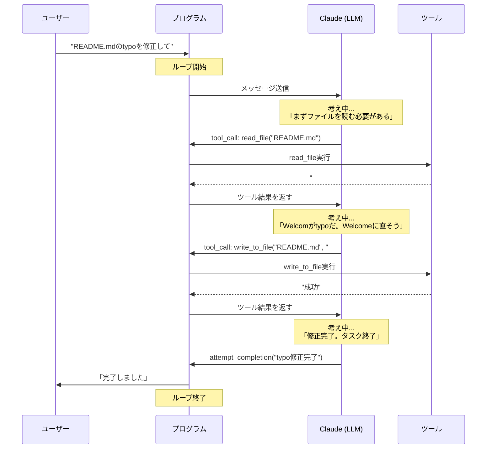
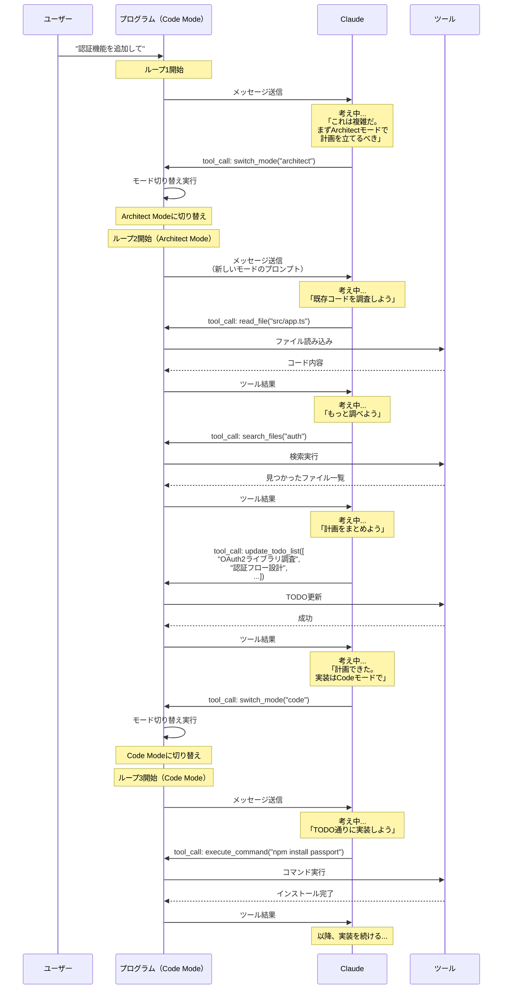
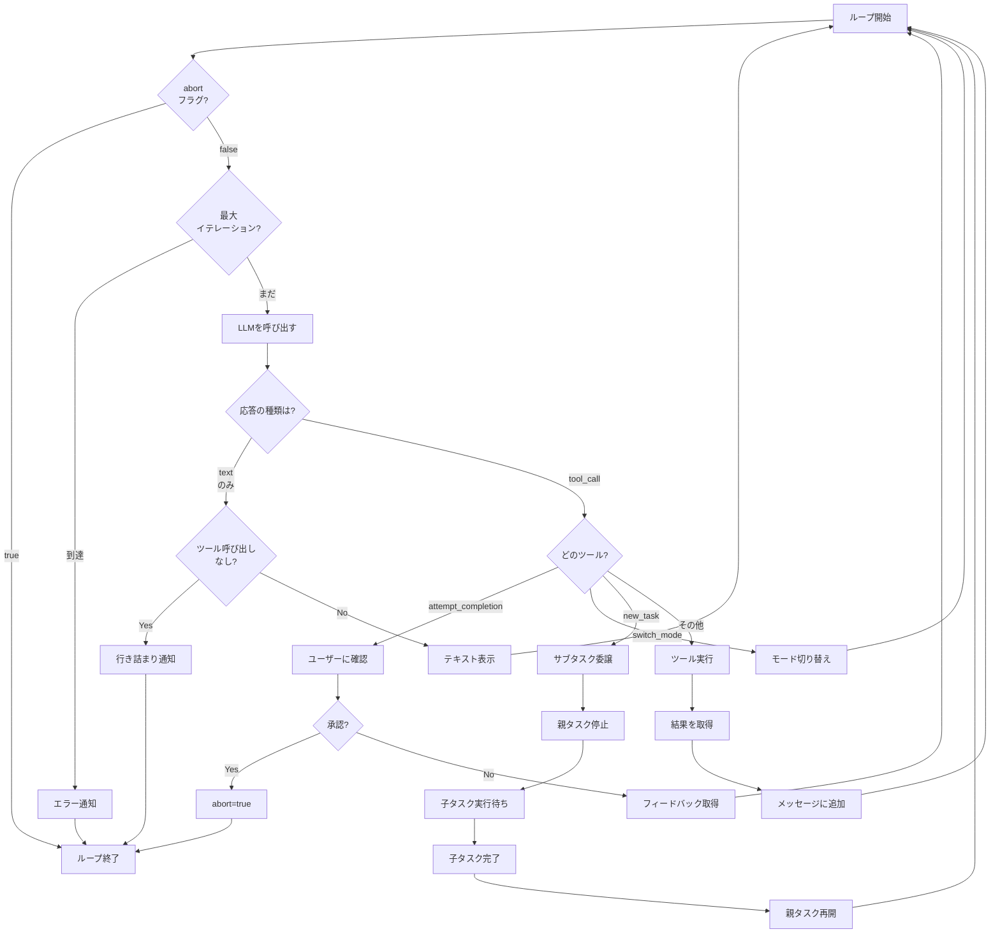

# Roo Codeの制御フローを高校生でもわかるように解説

## 🎯 この文書の目的

Roo Codeが「次に何をするか」をどうやって決めているのか、LLM（Claude）とプログラムがどう協力しているのかを、**具体例を使って**わかりやすく説明します。

---

## 🤖 そもそもLLM（Claude）とは？

### LLMができること

LLM（Large Language Model）は**次のテキストを予測する巨大なAI**です。

```
入力: "今日の天気は"
出力: "晴れです" or "雨です" or ...
```

ただし、Claudeのような最新のLLMは**ツール（道具）を使うこともできる**ようになっています。

### ツールを使えるとは？

普通の会話だけでなく、**「このツールを使いたい」という指示も出せる**ということです。

**例**:
```
入力: 「README.mdの内容を教えて」

LLMの判断:
  ↓
「ファイルを読むツールを使う必要がある」
  ↓
出力: {
  "tool": "read_file",
  "parameters": {
    "path": "README.md"
  }
}
```

このツール呼び出しを**プログラム側が受け取って実行**し、結果をLLMに返します。

---

## 🔄 基本的な仕組み：無限ループ

Roo Codeの核心は、この**シンプルな無限ループ**です：

```typescript
// 超シンプル版
while (タスクが終わってない) {
  // 1. LLMに質問する
  const response = await callClaude(message)

  // 2. LLMの応答を見る
  if (response.type === "text") {
    // ただの返答 → ユーザーに表示
    console.log(response.text)

  } else if (response.type === "tool_call") {
    // ツールを使いたい → 実行する
    const result = await executeTool(response.tool, response.params)

    // 3. ツール結果をLLMに返す
    message = `ツールの結果: ${result}`
    // ↑ これで次のループへ

  } else if (response.type === "completion") {
    // 「完了しました」→ ループ終了
    break
  }
}
```

**重要なポイント**:
- **LLMが「次に何をするか」を決める**（ツールを使うか、話すだけか）
- **プログラムはループを回すだけ**
- **ツール結果をLLMに返す**と、LLMはそれを見て次の判断をする

---

## 📊 具体例1：簡単なタスク「README.mdのtypoを修正して」

### 実際の処理の流れ



### 各ステップの詳細

#### ステップ1: ファイルを読む判断

**LLMへの入力**:
```
System: あなたはコード編集アシスタントです。以下のツールが使えます：
- read_file: ファイルを読む
- write_to_file: ファイルに書き込む
- attempt_completion: タスク完了

User: README.mdのtypoを修正して
```

**LLMの思考**（内部で起きていること）:
```
README.mdを修正するには、まず内容を確認する必要がある
→ read_fileツールを使おう
```

**LLMの出力**:
```json
{
  "type": "tool_call",
  "tool": "read_file",
  "parameters": {
    "path": "README.md"
  }
}
```

#### ステップ2: プログラムがツールを実行

```typescript
// プログラム側の処理
const toolCall = response.tool_call

if (toolCall.name === "read_file") {
  // ファイル読み込み実行
  const content = fs.readFileSync(toolCall.parameters.path, 'utf-8')

  // LLMに結果を返すメッセージを作成
  const toolResult = {
    role: "user",
    content: [{
      type: "tool_result",
      tool_use_id: toolCall.id,
      content: content  // ← ファイルの内容
    }]
  }

  // 次のループでこれをLLMに送る
}
```

#### ステップ3: ツール結果を見てLLMが次を判断

**LLMへの入力**（2回目のループ）:
```
[前の会話履歴...]

User: (tool_result)
# Welcom to My Project

This is a sample project.
```

**LLMの思考**:
```
「Welcom」はtypo。正しくは「Welcome」
→ write_to_fileツールで修正しよう
```

**LLMの出力**:
```json
{
  "type": "tool_call",
  "tool": "write_to_file",
  "parameters": {
    "path": "README.md",
    "content": "# Welcome to My Project\n\nThis is a sample project."
  }
}
```

#### ステップ4: 修正実行後、完了判断

**LLMへの入力**（3回目のループ）:
```
[前の会話履歴...]

User: (tool_result)
File written successfully
```

**LLMの思考**:
```
ファイル書き込み成功。typo修正完了した
→ attempt_completionツールで終了を伝えよう
```

**LLMの出力**:
```json
{
  "type": "tool_call",
  "tool": "attempt_completion",
  "parameters": {
    "result": "README.mdのtypo「Welcom」を「Welcome」に修正しました"
  }
}
```

#### ステップ5: プログラムがループを終了

```typescript
if (toolCall.name === "attempt_completion") {
  // ユーザーに確認
  const ok = await askUser("タスク完了でいいですか？", toolCall.parameters.result)

  if (ok) {
    // ループ終了フラグを立てる
    this.abort = true
  }
}

// while (!this.abort) のチェックでループ終了
```

---

## 🎭 具体例2：複雑なタスク「認証機能を追加して」

### なぜ複雑か？

このタスクは：
1. **調査が必要**（既存のコードを理解）
2. **計画が必要**（どういう順番で作るか）
3. **複数ファイルの変更**
4. **テストも必要**

→ 1つのモードでは難しい！

### 実際の処理の流れ



### 重要ポイント：誰が何を決めているか

| 判断 | 誰が決めるか | どうやって？ |
|------|------------|------------|
| **モード切り替えが必要か** | **Claude (LLM)** | `switch_mode`ツールを呼び出す |
| **どのツールを使うか** | **Claude (LLM)** | 状況を見て判断 |
| **ループを続けるか** | **プログラム** | `attempt_completion`が呼ばれたらループ終了 |
| **ツールの実行** | **プログラム** | LLMの指示通りに実行 |

---

## 🎯 具体例3：さらに複雑「コードベース全体をTypeScriptに変換」

このタスクは**1つのタスクでは無理**です。

### LLMの判断：Orchestratorモードを使う

**LLMへの入力**（Orchestrator Mode）:
```
System: あなたは戦略的コーディネーターです。
複雑なタスクを独立したサブタスクに分割できます。

以下のツールが使えます：
- new_task: 新しいサブタスクを別モードで起動
- update_todo_list: タスク計画を作成
...

User: コードベース全体をTypeScriptに変換して
```

**LLMの思考**:
```
これは巨大すぎる。分割しよう：
1. バックエンドの変換
2. フロントエンドの変換
3. ビルド設定の更新
4. 型エラー修正
5. テスト更新

各部分を別々のCodeモードタスクとして委譲しよう
```

**LLMの出力**:
```json
{
  "type": "tool_call",
  "tool": "new_task",
  "parameters": {
    "mode": "code",
    "message": "backend/フォルダ内のすべての.jsファイルを.tsに変換してください",
    "todos": [
      "backend/models/*.js を変換",
      "backend/routes/*.js を変換",
      "backend/utils/*.js を変換"
    ]
  }
}
```

### プログラムの処理：サブタスク委譲

```typescript
// new_taskツールが呼ばれたとき
async executeNewTask(params) {
  // 1. 現在のタスク（親）を一時停止
  this.currentTask.status = "delegated"  // 「委譲中」状態に
  this.currentTask.save()

  // 2. 新しい子タスクを作成
  const childTask = new Task({
    mode: params.mode,  // "code"
    initialMessage: params.message,
    todos: params.todos,
    parentTaskId: this.currentTask.id  // 親を記憶
  })

  // 3. 子タスクを実行開始
  await childTask.start()

  // 4. ここで親のループは停止
  //    子が完了するまで待つ
}
```

### 子タスクの実行

子タスクは**独立したループ**を持ちます：

```typescript
// 子タスクのループ
class ChildTask {
  async start() {
    while (!this.abort) {
      const response = await callClaude(this.message)

      if (response.type === "tool_call") {
        // 子タスク専用のツール実行
        const result = await this.executeTool(response)
        this.message = result

      } else if (response.type === "attempt_completion") {
        // 子タスク完了！
        await this.completeAndReturnToParent(response.result)
        break
      }
    }
  }
}
```

### 子タスク完了時：親に戻る

```typescript
async completeAndReturnToParent(result) {
  // 1. 子タスクを「完了」状態に
  this.status = "completed"
  this.save()

  // 2. 親タスクをロード
  const parentTask = await Task.load(this.parentTaskId)

  // 3. 親タスクの状態を「アクティブ」に戻す
  parentTask.status = "active"

  // 4. 親タスクのメッセージ履歴に結果を追加
  //   （まるで「new_taskツールの実行結果」のように）
  parentTask.messages.push({
    role: "user",
    content: [{
      type: "tool_result",
      tool_use_id: this.parentToolCallId,  // 元のnew_task呼び出しのID
      content: result  // ← 子タスクの結果
    }]
  })

  // 5. 親タスクのループを再開
  await parentTask.resume()
}
```

### 親タスクの再開

```typescript
// 親タスク（Orchestrator）のループが再開
async resume() {
  // 前回の続きから
  // メッセージ履歴には子の結果が入っている

  while (!this.abort) {
    const response = await callClaude(this.messages)

    // LLMは子の結果を見て次を判断
    // 例：「バックエンド完了。次はフロントエンド」
    if (response.type === "tool_call" && response.tool === "new_task") {
      // また次の子タスクを起動
      await this.executeNewTask(response.parameters)
    }
  }
}
```

### 全体の流れ

```
[親タスク - Orchestrator Mode]
  ↓
  new_task("バックエンド変換")
  ↓
  [親タスク: 停止・待機]

      [子タスク1 - Code Mode]
        ↓
        backend変換作業...
        ↓
        attempt_completion("完了")
        ↓
      [子タスク1: 終了]

  [親タスク: 再開]
  ↓
  LLMが子1の結果を見る
  ↓
  new_task("フロントエンド変換")
  ↓
  [親タスク: 停止・待機]

      [子タスク2 - Code Mode]
        ↓
        frontend変換作業...
        ↓
        attempt_completion("完了")
        ↓
      [子タスク2: 終了]

  [親タスク: 再開]
  ↓
  LLMが子2の結果を見る
  ↓
  new_task("ビルド設定更新")
  ↓
  ...（以下同様）
```

---

## 🔍 終了判定：タスクをいつ終わらせるか

### 3つの終了パターン

#### 1. LLMが「完了」と判断

**最も一般的なパターン**

```typescript
// LLMの判断
if (タスクの目標を達成した) {
  return {
    type: "tool_call",
    tool: "attempt_completion",
    parameters: {
      result: "〇〇を完了しました"
    }
  }
}

// プログラム側
if (toolCall.name === "attempt_completion") {
  // ユーザーに確認
  const approved = await this.ask("completion_result", toolCall.parameters.result)

  if (approved) {
    this.abort = true  // ループ終了
  } else {
    // ユーザーが「まだ」と言った
    // → ユーザーのフィードバックをLLMに返してループ続行
  }
}
```

**LLMはどう判断するか？**

システムプロンプトに書いてあります：

```
When you believe the task is complete:
1. Verify that all requirements are met
2. Test your changes if applicable
3. Use the attempt_completion tool with a summary

Only mark as complete when:
- All TODO items are done
- Tests pass (if applicable)
- No errors remain
```

#### 2. ツールが使われなかった（行き詰まり）

```typescript
while (!this.abort) {
  const response = await callClaude(this.messages)

  if (response.type === "text" && !response.tool_calls) {
    // LLMがツールを使わず、ただテキストを返した
    // = 「これ以上できることがない」

    await this.say("text",
      "I couldn't find any actions to take. " +
      "Please provide more information or clarify the task."
    )

    // ループ終了（ユーザーの追加指示を待つ）
    break
  }
}
```

#### 3. 最大イテレーション到達（無限ループ防止）

```typescript
const MAX_ITERATIONS = 100  // 例

while (!this.abort && this.iterationCount < MAX_ITERATIONS) {
  this.iterationCount++

  // ... ループ処理
}

if (this.iterationCount >= MAX_ITERATIONS) {
  await this.say("error",
    "Reached maximum iterations. The task may be too complex or unclear."
  )
}
```

---

## 🔄 ループを続けるか？の判定フロー全体



---

## 💡 わかりやすいアナロジー：レストランの調理

Roo Codeの仕組みを、レストランに例えてみます。

### 登場人物

- **あなた（ユーザー）**: お客さん
- **Claude (LLM)**: シェフ（料理長）
- **プログラム**: キッチンアシスタント
- **ツール**: 調理器具（包丁、鍋、オーブンなど）

### シナリオ：「フルコース料理を作って」

#### パターン1：簡単な料理（Code Mode）

```
あなた: 「オムレツを作って」

シェフ: 「わかりました」
       「キッチンアシスタント、卵を取って」
       ↓
アシスタント: 🥚 卵を渡す
       ↓
シェフ: 「ありがとう。次にフライパンを熱して」
       ↓
アシスタント: 🍳 フライパンを熱する
       ↓
シェフ: 「卵を焼いて」
       ↓
アシスタント: 調理実行
       ↓
シェフ: 「オムレツ完成！お客さんに出していいか確認して」
       ↓
アシスタント: あなたに確認
       ↓
あなた: 「OK！」
       ↓
完了
```

#### パターン2：複雑な料理（Mode切り替え）

```
あなた: 「ビーフウェリントンを作って」

シェフ: 「これは複雑だ...まず計画を立てよう」
       「アシスタント、Architectモード（計画モード）に切り替えて」
       ↓
[Architect Mode]
シェフ: 「レシピを調べて」
       ↓
アシスタント: 📖 レシピを取得
       ↓
シェフ: 「材料リストを作って」
       1. 牛フィレ肉
       2. パイ生地
       3. マッシュルーム
       ...
       ↓
シェフ: 「計画できた。Codeモード（実行モード）に切り替えて」
       ↓
[Code Mode]
シェフ: 「牛肉を焼いて」
       ↓
アシスタント: 🥩 調理実行
       ↓
シェフ: 「マッシュルームソースを作って」
       ↓
... (以下続く)
```

#### パターン3：フルコース（Orchestrator Mode）

```
あなた: 「フルコース料理を作って」

シェフ: 「これは1人では大変だ。専門シェフに分担しよう」
       ↓
[Orchestrator Mode]
シェフ: 「アシスタント、前菜担当シェフを呼んで（new_task）」
       ↓
アシスタント: 別のシェフを呼ぶ（子タスク起動）
       ↓
　　　　[前菜シェフ - Code Mode]
　　　　シェフ2: 「前菜を作ります」
　　　　       → カプレーゼ完成
　　　　       「前菜完了！」
       ↓
シェフ: 「前菜OK。次はメイン担当シェフを呼んで」
       ↓
　　　　[メインシェフ - Code Mode]
　　　　シェフ3: 「メインを作ります」
　　　　       → ステーキ完成
　　　　       「メイン完了！」
       ↓
シェフ: 「次はデザート担当を...」
       ↓
全て完成！
```

### キーポイント

| 要素 | レストラン | Roo Code |
|------|-----------|----------|
| **判断** | シェフが決める | Claude (LLM)が決める |
| **実行** | アシスタントがやる | プログラムが実行 |
| **道具** | 包丁、鍋、オーブン | ツール（read_file, execute_commandなど） |
| **レシピ** | 頭の中の知識 | システムプロンプト |
| **完了判定** | シェフが「できた」と言う | LLMが`attempt_completion` |
| **タスク分割** | 専門シェフに分担 | `new_task`でサブタスク |

---

## 🎓 まとめ：誰が何を決めているか

### LLM（Claude）の役割

✅ **次に何をするか決める**
- 「ファイルを読もう」
- 「コマンドを実行しよう」
- 「モードを切り替えよう」
- 「サブタスクに委譲しよう」
- 「完了だ」

✅ **どのツールを使うか決める**
- `read_file`, `write_to_file`, `execute_command`, ...

✅ **パラメータを決める**
- ファイルのパス
- コマンドの内容
- 次のモード

### プログラムの役割

✅ **ループを回す**
```typescript
while (!abort) {
  // LLMを呼ぶ
  // ツールを実行
  // 結果を返す
}
```

✅ **ツールを実際に実行**
- ファイル読み書き
- コマンド実行
- モード切り替え

✅ **終了条件のチェック**
- `abort`フラグ
- 最大イテレーション

✅ **ユーザーとの対話**
- ツール実行の承認
- タスク完了の確認

### ユーザーの役割

✅ **最初のタスクを与える**

✅ **ツール実行を承認する**（設定による）

✅ **完了を承認する**

✅ **フィードバックを与える**（必要に応じて）

---

## 🔬 実際のコードで見る

### LLMへのシステムプロンプト（抜粋）

```typescript
const SYSTEM_PROMPT = `
You are Roo, an expert software engineer.

# Available Tools

You have access to these tools:
- read_file(path): Read a file
- write_to_file(path, content): Write to a file
- execute_command(command): Run a shell command
- switch_mode(mode): Switch to a different mode
- new_task(mode, message): Delegate to a subtask
- attempt_completion(result): Mark task as complete

# Decision Making

For each message, decide:
1. Do I need more information? → Use read_file or search tools
2. Do I need to make changes? → Use write_to_file or edit tools
3. Is this task too complex for current mode? → Use switch_mode
4. Should I delegate? → Use new_task
5. Am I done? → Use attempt_completion

# Important Rules

- NEVER make changes without reading the relevant files first
- ALWAYS test your changes when possible
- Use attempt_completion ONLY when the task is truly complete
- If unsure, ask the user with ask_user_question tool
`
```

これを読んだLLMは、**自分で次のアクションを決めます**。

### プログラム側のループ（簡略版）

```typescript
async function taskLoop() {
  let messages = [
    { role: "user", content: "ユーザーのタスク" }
  ]

  while (!abort && iterationCount < MAX_ITERATIONS) {
    iterationCount++

    // 1. LLM呼び出し
    const response = await callClaude({
      system: SYSTEM_PROMPT,
      messages: messages
    })

    // 2. 応答の種類で分岐
    if (response.stop_reason === "end_turn") {
      // ただのテキスト → ツール呼び出しなし
      console.log(response.content)

      if (!hasToolCalls(response)) {
        // 行き詰まり
        break
      }

    } else if (response.stop_reason === "tool_use") {
      // ツール呼び出しあり
      for (const toolCall of response.content) {
        if (toolCall.type === "tool_use") {
          // 3. ツール実行
          const result = await executeToolByName(
            toolCall.name,
            toolCall.input
          )

          // 4. 結果をメッセージに追加
          messages.push({
            role: "user",
            content: [{
              type: "tool_result",
              tool_use_id: toolCall.id,
              content: result
            }]
          })

          // 5. 完了判定
          if (toolCall.name === "attempt_completion") {
            const ok = await askUser("Complete?", result)
            if (ok) {
              abort = true
            }
          }

          // 6. モード切り替え
          if (toolCall.name === "switch_mode") {
            currentMode = toolCall.input.mode
            // システムプロンプトを再構築
            SYSTEM_PROMPT = buildSystemPrompt(currentMode)
          }

          // 7. サブタスク委譲
          if (toolCall.name === "new_task") {
            await delegateToSubtask(toolCall.input)
            // このループは停止、子タスク完了後に再開
          }
        }
      }
    }

    // 次のループへ（メッセージにツール結果が追加されている）
  }
}
```

---

## 📝 練習問題

### Q1: 次のシナリオで、誰が何を決めているか答えてください

**シナリオ**: 「package.jsonにexpressを追加して」

1. 「package.jsonを読む必要がある」と判断するのは？
   - **答え**: Claude (LLM)

2. 実際にファイルを読むのは？
   - **答え**: プログラム（ツール実行部分）

3. 「expressを追加する内容」を決めるのは？
   - **答え**: Claude (LLM)

4. ファイルに書き込むのは？
   - **答え**: プログラム（write_to_fileツール）

5. 「タスク完了」と判断するのは？
   - **答え**: Claude (LLM)

### Q2: 次のうち、LLMが**できない**ことはどれ？

- A. 次に使うツールを決める
- B. ファイルの内容を読む
- C. モードを切り替える判断をする
- D. 実際にファイルを書き込む

**答え**: **D**（実際の書き込みはプログラムが行う）

---

## 🎯 最後に：制御フローの本質

Roo Codeの制御フローは、**LLMとプログラムの協力**です：

1. **LLMは「脳」** → 何をすべきか考える
2. **プログラムは「手足」** → 実際に実行する
3. **ツールは「道具」** → 両者をつなぐ

この**シンプルなループ**が、複雑なタスクを可能にしています。

```
考える（LLM） → 実行する（プログラム） → 結果を見る（LLM） → 次を考える（LLM） → ...
```

これが無限に続くことで、どんな複雑なタスクも**一歩ずつ**進められるのです。

---

**参考資料**:
- [05-task-execution-flow.md](./05-task-execution-flow.md) - より詳細な技術説明
- `src/core/task/Task.ts` - 実際の実装コード
